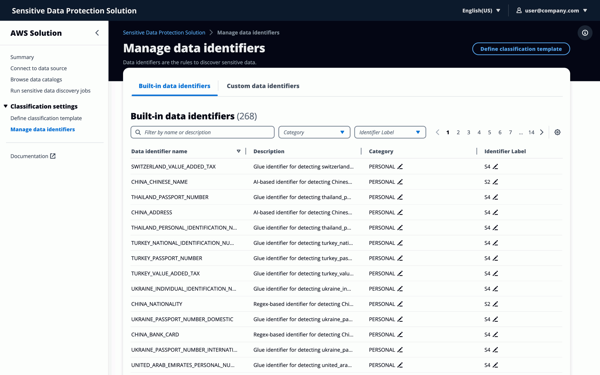
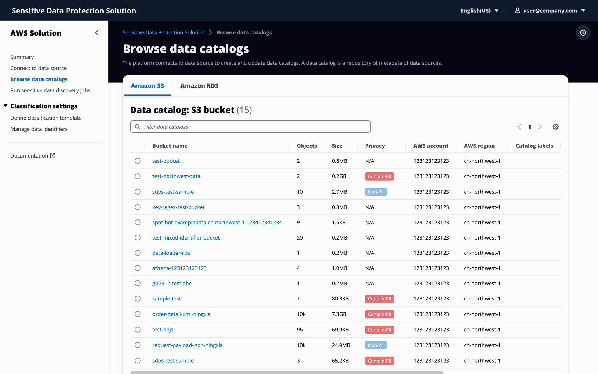

English | [简体中文](README_zh.md)

<p align="center">
    <h3 align="center">Sensitive Data Protection Solution on AWS</h3>
</p>
<p align="center">Secure sensitive data across multiple AWS accounts, including PII.</p>

<p align="center">
  <a href="https://awslabs.github.io/sensitive-data-protection-on-aws/en/"><strong>Documentation</strong></a> ·
  <a href="https://github.com/awslabs/sensitive-data-protection-on-aws/releases"><strong>Changelog</strong></a>
</p>

<p align="center">
  <a href="https://opensource.org/licenses/Apache-2.0"></a>
</p>

<br/>

## Introduction

The Sensitive Data Protection on AWS solution allows enterprise customers to create data catalogs, discover, protect, and visualize sensitive data across multiple AWS accounts. The solution eliminates the need for manual tagging to track sensitive data such as Personal Identifiable Information (PII) and classified information.

The solution provides an automated approach to data protection with a self-service web application. You can perform regular or on-demand sensitive data discovery jobs using your own data classification templates. Moreover, you can access metrics such as the total number of sensitive data entries stored in all your AWS accounts, which accounts contain the most sensitive data, and the data source where the sensitive data is located. 

<div align="center">
    
    
    
</div>

## Quick deployment

This project is an AWS [Cloud Development Kit(CDK)](https://aws.amazon.com/cdk/) project written in Typescript, if you want to use this solution without building the entire project, you can use the [Amazon CloudFormation](https://aws.amazon.com/cloudformation/) template to deploy the solution in 20 minutes, please follow the [Implementation Guide](https://awslabs.github.io/sensitive-data-protection-on-aws/en/) to deploy the solution in your AWS account.

## Architecture

The Solution uses [AWS Glue](https://aws.amazon.com/glue/) service for data catalog acquisition in the monitored account(s) and invoking Glue Job for sensitive data PII detection. The distributed Glue job runs in each monitored account and the admin account contains centralized data catalog of data stores across AWS accounts.


1. The [Application Load Balancer](https://aws.amazon.com/alb/) distributes the solution's frontend web UI assets hosted in [AWS Lambda](https://aws.amazon.com/lambda/). 
2. Identity provider for user authentication. 
3. The AWS Lambda function is packaged as Docker images and stored in the [Amazon ECR (Elastic Container Registry)](https://aws.amazon.com/ecr/). 
4. The backend Lambda function is a target for the Application Load Balancer. 
5. The backend Lambda function invokes [AWS Step Functions](https://aws.amazon.com/step-functions/) in monitored accounts for sensitive data detection. 
6. In [AWS Step Functions](https://aws.amazon.com/step-functions/) workflow, the [AWS Glue](https://aws.amazon.com/glue/) Crawler runs to take inventory of the data sources and is stored in the Glue Database as metadata tables.
7. The Step Functions send [Amazon SQS](https://aws.amazon.com/sqs/) messages to the detection job queue after the Glue job has run. 
8. Lambda function processs messages from Amazon SQS.
9. The [Amazon Athena](https://aws.amazon.com/athena/) query detection results and save to MySQL instance in [Amazon RDS](https://aws.amazon.com/rds/).


## License

Copyright Amazon.com, Inc. or its affiliates. All Rights Reserved.
Licensed under the Apache License Version 2.0 (the "License"). You may not use this file except in compliance with the License. A copy of the License is located at

```
http://www.apache.org/licenses/
```

or in the "license" file accompanying this file. This file is distributed on an "AS IS" BASIS, WITHOUT WARRANTIES OR CONDITIONS OF ANY KIND, express or implied. See the License for the specific language governing permissions and limitations under the License.