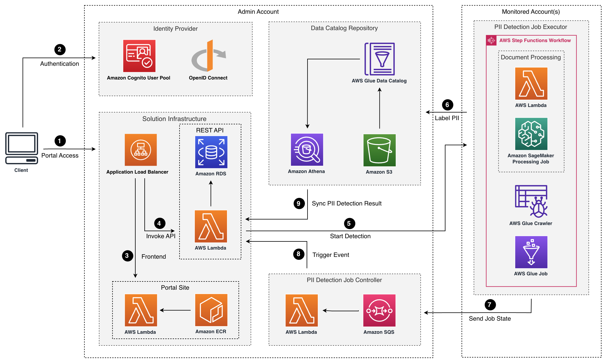

[English](README.md) | 简体中文

<p align="center">
    <h3 align="center">Sensitive Data Protection Solution on AWS</h3>
</p>
<p align="center">在多个AWS账户中保护包括PII在内的敏感数据</p>

<p align="center">
  <a href="https://awslabs.github.io/sensitive-data-protection-on-aws/en/"><strong>Documentation</strong></a> ·
  <a href="https://github.com/awslabs/sensitive-data-protection-on-aws/releases"><strong>Changelog</strong></a>
</p>

<p align="center">
  <a href="https://opensource.org/licenses/Apache-2.0"></a>
</p>

<br/>

## 简介

AWS的敏感数据保护解决方案允许企业客户创建数据目录，跨多个AWS账户发现、保护和可视化敏感数据，包括个人身份信息（PII）和机密信息。该解决方案消除了手动标记敏感数据的需要，提供自动化的敏感数据保护。

该解决方案提供了一种自动化的数据保护方法，通过自助式Web应用程序实现。您可以使用自己的数据分类模板执行常规或按需敏感数据发现作业。此外，您还可以访问指标，例如存储在所有AWS账户中的敏感数据条目总数，包含最多敏感数据的账户以及敏感数据所在的数据源。

<div align="center">
    
    
    
</div>

## 快速部署

此项目是使用Typescript编写的AWS [Cloud Development Kit(CDK)](https://aws.amazon.com/cdk/) 项目。如果您想在无需构建整个项目的情况下使用此解决方案，可以使用[Amazon CloudFormation](https://aws.amazon.com/cloudformation/)模板，在20分钟内部署解决方案。请按照[实施指南]((https://awslabs.github.io/sensitive-data-protection-on-aws/en/))在您的AWS账户中部署解决方案。

## Architecture

该解决方案使用[AWS Glue](https://aws.amazon.com/glue/)服务来获取受监控帐户中的数据目录，并调用Glue Job来检测敏感数据PII。分布式的Glue作业在每个受监控的账户中运行，管理员账户包含跨AWS账户的数据存储的集中式数据目录。



1. 应用程序负载均衡器[Application Load Balancer](https://aws.amazon.com/alb/)将托管在[AWS Lambda](https://aws.amazon.com/lambda/)中的解决方案前端Web UI资源分发。
2. 用户身份验证。
3. AWS Lambda函数被打包为Docker镜像，并存储在[Amazon ECR (Elastic Container Registry)](https://aws.amazon.com/ecr/)中。
4. 应用程序负载均衡器调用后端Lambda函数。
5. 后端Lambda函数调用受监控账户中的[AWS Step Functions](https://aws.amazon.com/step-functions/)进行敏感数据检测。
6. 在[AWS Step Functions](https://aws.amazon.com/step-functions/)工作流中，[AWS Glue](https://aws.amazon.com/glue/) Crawler运行以对数据源进行清单，并将其存储为元数据表。
7. 在Glue作业运行后，Step Functions向检测作业队列发送[Amazon SQS](https://aws.amazon.com/sqs/)消息。
8. Lambda函数从Amazon SQS处理消息。
9. 使用[Amazon Athena](https://aws.amazon.com/athena/)查询检测结果，并将其保存到[Amazon RDS](https://aws.amazon.com/rds/)中的MySQL实例中。


## License

Copyright Amazon.com, Inc. or its affiliates. All Rights Reserved.
Licensed under the Apache License Version 2.0 (the "License"). You may not use this file except in compliance with the License. A copy of the License is located at

```
http://www.apache.org/licenses/
```

or in the "license" file accompanying this file. This file is distributed on an "AS IS" BASIS, WITHOUT WARRANTIES OR CONDITIONS OF ANY KIND, express or implied. See the License for the specific language governing permissions and limitations under the License.