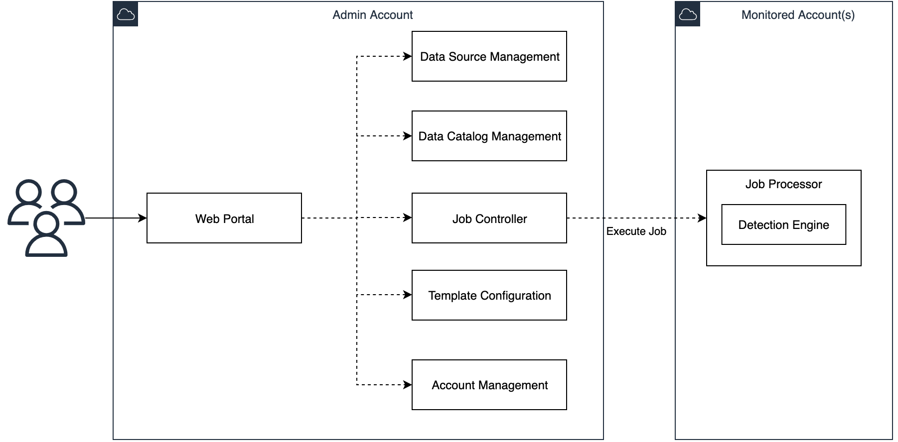

# Architecture details

This section describes the components and AWS services that make up this solution and the high level system design.

*Figure 1: SDPS high level system design*

In the diagram, the centralized sensitive data governance account is the admin account. Solution users, typically security auditors, can access the solution via a web portal. Users can browse the data catalog and execute sensitive data detection jobs in the monitored account(s) after logging into the web portal. 

Multiple monitored accounts are connected to the admin account with data source access and job execution privileges, so that the admin account can invoke the Job Processor model in the specified monitored account for sensitive data detection.

## Modules in Admin Account:

- **Web Portal (UI)**: The solution administrator or normal users can access the solution through the web portal. It provides secure user access management and a web UI for the solution.

- **Data Source Management (DSM)**: The DSM is responsible for retrieving the data sources from monitored accounts by the Data Source Detector and storing the data source structure. Users can explore the data storage in the monitored accounts, such as S3 buckets and RDS instances.

- **Data Catalog Management (DCM)**: The DCM can discover the latest schema (normally called metadata) of the data sources in DSM. The schema includes information such as table columns in RDS databases and the sensitive data detection results after the detection job has run.

- **Job Controller (JC)**: The Job Controller is responsible for executing the detection job in the monitored account and collecting the detection results back to the admin account. It can configure the job to run on a user-defined schedule or as needed.

- **Template Configuration (TC)**: The detection templates are stored in the TC model. It contains built-in templates and custom-defined templates. The JC can retrieve the templates for running the job processor.

- **Account Management (AM)**: The monitored AWS account(s) are managed by the AM model.

# Modules in Monitored Account(s):

- **Job Processor**: The Job Processor is the running container for sensitive data detection, invoked by the Job Controller. The Job Processor reads the raw data to the detection engine for detection and sends the analysis results and running state to the Job Controller.

- **Detection Engine**: The Detection Engine model is the core sensitive data detection engine with AI/ML support features. It receives the data from the Job Processor to identify the sensitive data type using a pre-trained ML model or pattern.