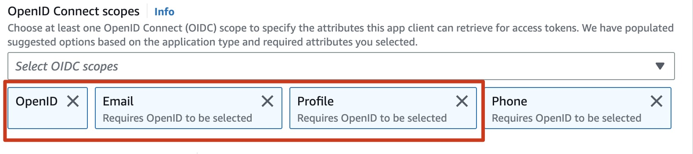
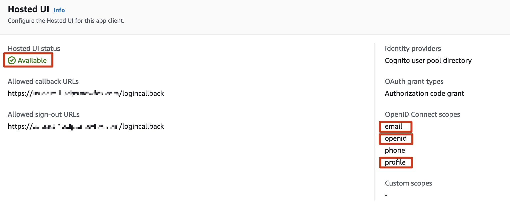
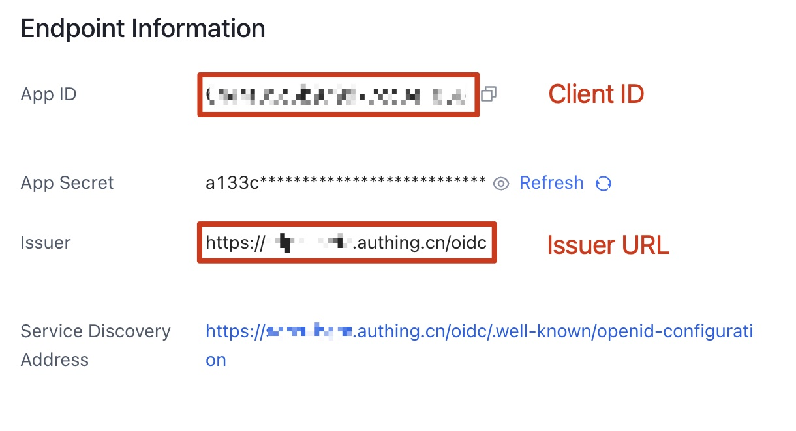
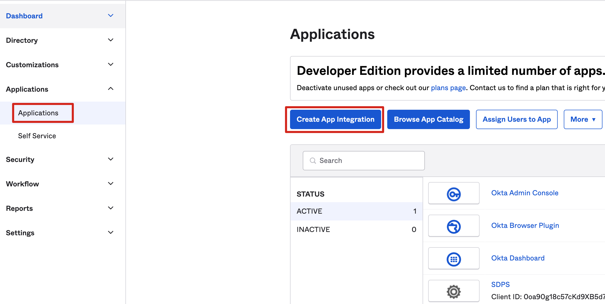
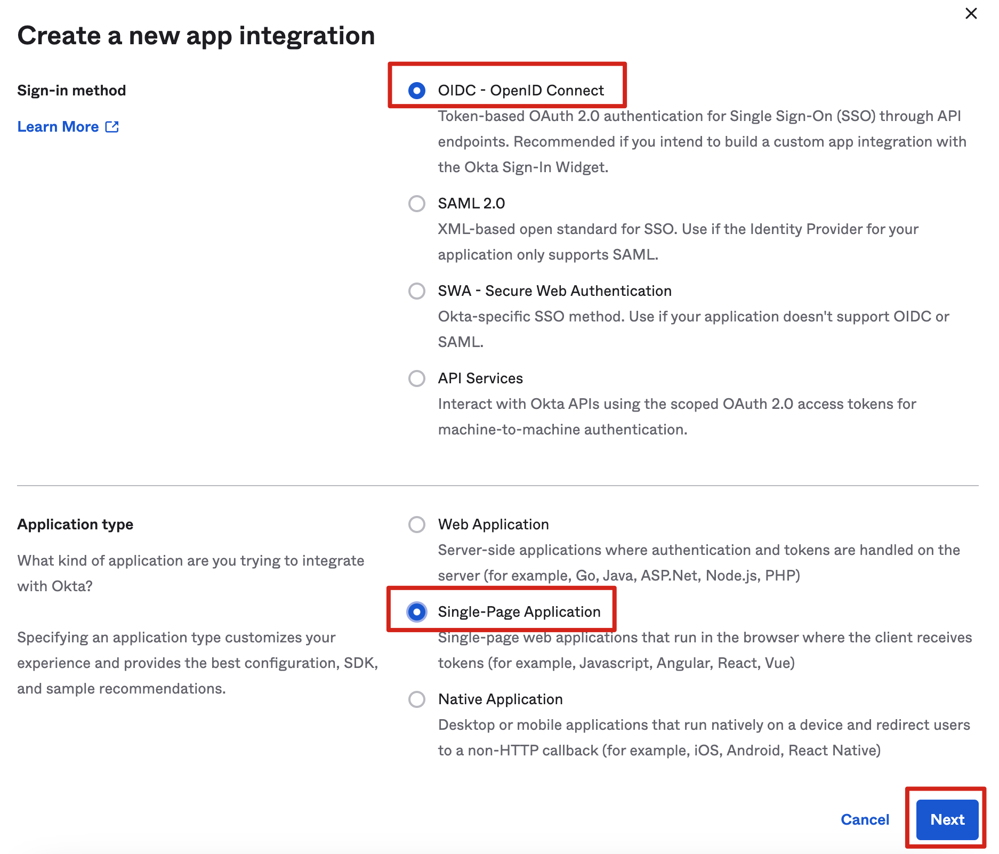
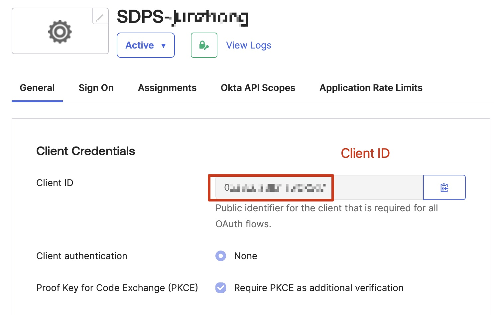
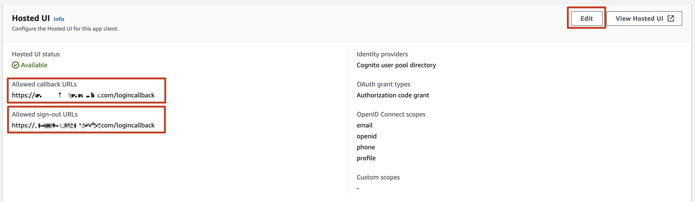
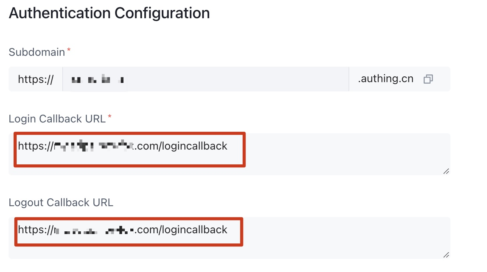

Before you launch the solution, review the architecture, supported regions, and other considerations discussed in this guide. Follow the step-by-step instructions in this section to configure and deploy the solution into your account.

**Time to deploy**: Approximately 30 minutes

## Deployment overview

Use the following steps to deploy this solution on AWS. 

- Create a user pool and an OIDC application.
- Deploy the AWS CloudFormation **Admin** template into your AWS admin account.
- (optional)If your accounts are all under the AWS organization, please deploy **IT** template under the IT account. The AWS organization root account needs to first register the IT account as a delegated administrator.
- Deploy the AWS CloudFormation **Agent** template into your AWS account that need to be detected.

## Deployment steps

### Create a user pool and an OIDC application
You can use different kinds of OpenID Connector (OIDC) providers. This section introduces Option 1 to Option 3.
- Option 1: Using Amazon Cognito as OIDC provider.

- Option 2: Authing, which is an example of a third-party authentication provider.

- Option 3: OKTA, which is an example of a third-party authentication provider.

#### Option 1:Cognito
You can leverage the [Cognito User Pool](https://docs.aws.amazon.com/cognito/latest/developerguide/cognito-user-identity-pools.html) in a supported AWS Region as the OIDC provider.
1. Go to the [Amazon Cognito console](https://us-east-1.console.aws.amazon.com/cognito/v2/idp/user-pools/create?region=us-east-1) in an AWS Standard Region.

1. Set up the hosted UI with the Amazon Cognito console based on this [guide](https://docs.aws.amazon.com/cognito/latest/developerguide/cognito-user-pools-app-integration.html#cognito-user-pools-create-an-app-integration).

1. Choose **Public client** when selecting the **App type**.Choose **Don't generate a client secret** when selecting **Client secret**.

1. In **Advanced app client settings**,Selected **OpenID**,**Email** and **Profile** when setting **OpenID Connect scopes**.

1. Confirm that the **Hosted UI status** is **Available**. Confirm that the **OpenID Connect scopes** includes **email**, **openid**, and **profile**.

1. Save the App **Client ID**, **User pool ID** and the **AWS Region** to a file, which will be used later.  
In the next section **Deploy admin stack**, the **Client ID** is the App **Client ID**, and **Issuer URL** is `https://cognito-idp.${REGION}.amazonaws.com/${USER_POOL_ID}`

#### Option 2:Authing
1. Go to the [Authing console](https://www.authing.cn/).

2. On the left navigation bar, select Self-built App under Applications.

3. Click the Create button.

4. Enter the Application Name, and Subdomain.

5. Save the **App ID**(that is, Client ID) and **Issuer**(Issuer URL) to a text file from Endpoint Information, which will be used later.

6. Set the Authorization Configuration in **Protocol Configuration** tab.

7. On the Access Authorization tab, select the accessible users.

#### Option 3:OKTA
1. Go to the [OKTA console](https://developer.okta.com/login/).

1. Click Applications → Create App Integration

1. choose **OIDC - OpenID Connect** → choose **Single-Page Application** → Click **Next**

1. At Controlled access, Choose the way that suits you.

1. Save the Client ID and Issuer URL to a text file from Endpoint Information, which will be used later.  
The Issuer URL is in your profile.The full Issuer URL is “https://dev-xxx.okta.com”.
  

### Deploy admin stack
1. Sign in to the AWS Management Console and use [Global region template(New VPC)](https://aws-gcr-solutions.s3.amazonaws.com/aws-sensitive-data-protection/1.0.0/default/Admin.template.json) or [China region template(New VPC)](https://aws-gcr-solutions.s3.cn-north-1.amazonaws.com.cn/aws-sensitive-data-protection/1.0.0/cn/Admin.template.json) to launch the AWS CloudFormation template.
2. To launch this solution in a different AWS Region, use the Region selector in the console navigation bar.
3. On the **Create stack** page, verify that the correct template URL is shown in the **Amazon S3 URL** text box and choose **Next**.
4. On the **Specify stack details** page, assign a valid and account level unique name to your solution stack.
5. Under **Parameters**, review the parameters for the template and modify them as necessary. This solution uses the following default values.

    |      Parameter      |    Default   |                                                      Description                                                      |
    |:-------------------:|:------------:|:--------------------------------------------------------------------------------------------------------------|
    |Issuer URL||Specify the secure OpenID Connect URL. Maximum 255 characters. URL must begin with "https://"|
    |Client ID||Specify the client ID issued by the identity provider. Maximum 255 characters. Use alphanumeric or ?:_.-/? characters |
    |Public Access | Yes |If you choose No, the portal website can be accessed ONLY in the VPC. If you want to access the portal website over Internet, you need to choose Yes |
    |Port|80|If an ACM certificate ARN has been added, we recommend using port 443 as the default port for HTTPS protocol. Otherwise, port 80 can be set as an alternative option|
    |ACM Certificate ARN||(optional)To enable secure communication through encryption and enhancing the security of the solution, you can add a public certificate ARN from ACM to create the portal website URL based on the HTTPS protocol|
    |Custom Domain Name||(optional)By adding your own domain name, such as sdps.example.com, you can directly access the portal website by adding a CNAME record to that domain name after deploying the stack.Only fill in the domain name, do not fill in http(s)://|

6. Choose **Next**.
7. On the **Configure stack options** page, choose **Next**.
8. On the **Review** page, review and confirm the settings. Select 3 checkboxes that I acknowledge.
9. Choose **Create stack** to deploy the stack.  
Wait about 20mins to ensure that all related resource are created. 
You can choose the “Resource” and “Event” tab to see the status of the stack.
10. In the “Outputs” tab, you will see the portal URL and SigninRedirectUri.

### Configure OIDC application

Copy the value of SigninRedirectUriHTTP(S) and config it into your OIDC application
#### Option 1:Cognito
**Your user pools** -> **App integration** -> **Your App**

#### Option 2:Authing

#### Option 3:OTKA

### Configure custom domain name

If a custom domain name is filled in when creating the stack, set the CName of the custom domain name to LoadBalancerDnsNameHTTP(S) value on the output tab of CloudFormat.

### Open the solution portal

The portal is the value of **PortalUrlHTTP(S)** on the output tab of CloudFormat 

### Deploy agent stack

The installation steps are the same as the Admin stack.

[China region agent template](https://aws-gcr-solutions.s3.cn-north-1.amazonaws.com.cn/aws-sensitive-data-protection/1.0.0/cn/Agent.template.json)

[Global region agent template](https://aws-gcr-solutions.s3.amazonaws.com/aws-sensitive-data-protection/1.0.0/default/Agent.template.json)

Fill in “Stack name”  in step 1 page, and parse your admin account(12 digits) in “AdminAccountId” parameter.
