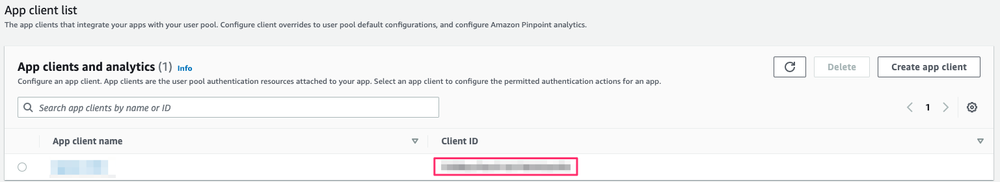
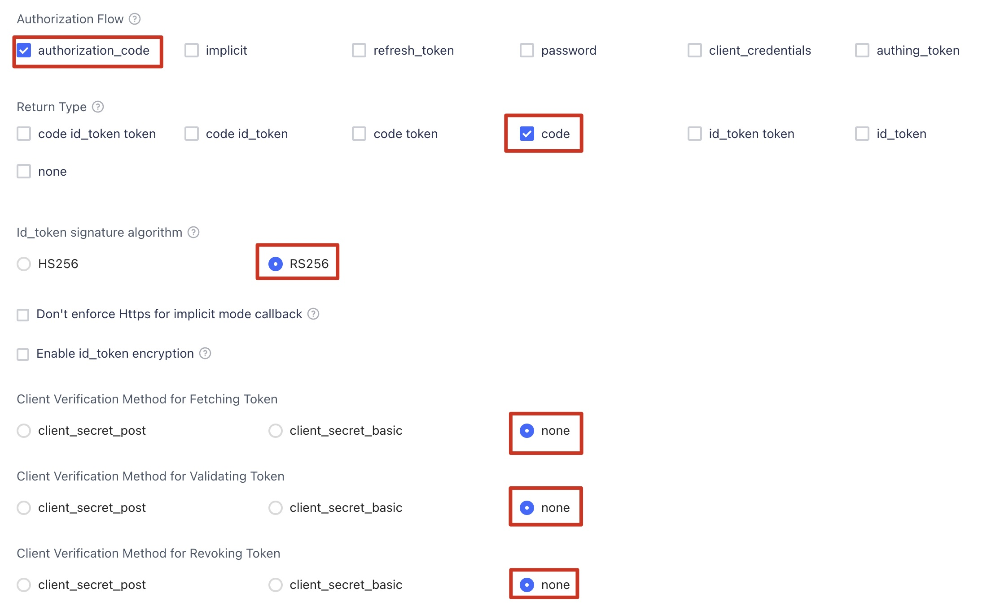
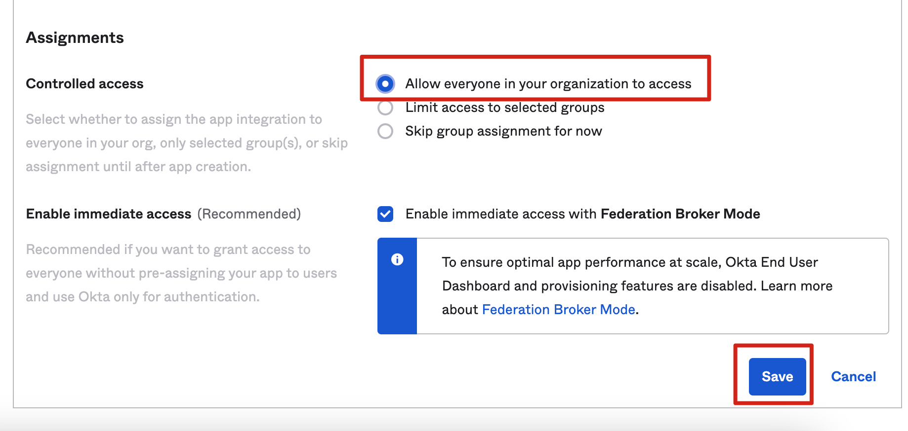
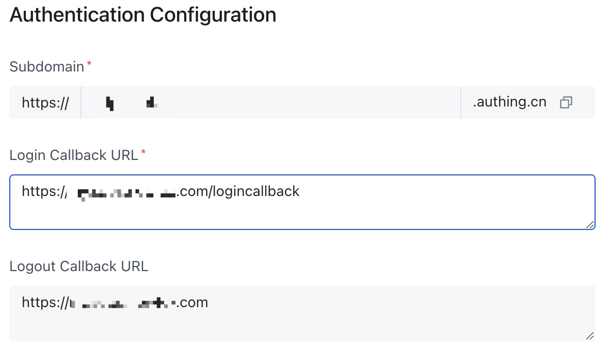

Before you launch the solution, review the architecture, supported regions, and other considerations discussed in this guide. Follow the step-by-step instructions in this section to configure and deploy the solution into your account.

**Time to deploy**: Approximately 30 minutes

## Deployment overview

Use the following steps to deploy this solution on AWS. 

- Step 1. Create an OpenID Connector (OIDC) application(Skip this step by using the template with an identity provider)

- Step 2. Deploy the Admin stack

- Step 3. Configure the OIDC application(Skip this step by using the template with an identity provider)

- Step 4. Configure custom domain name

- Step 5. Launch the solution console

- Step 6. Deploy the Agent stack

## Deployment steps
### Step 1. Create an OIDC application
!!! Info "Remind"
    Skip this step by using the template with an identity provider
You can use different kinds of OIDC providers. This section introduces Option 1 to Option 3.

- Option 1: Cognito, which uses Amazon Cognito as OIDC provider

- Option 2: Authing, which is an example of third-party authentication providers

- Option 3: OKTA, which is an example of third-party authentication providers

#### Option 1: Cognito
You can leverage the [Cognito User Pool](https://docs.aws.amazon.com/cognito/latest/developerguide/cognito-user-identity-pools.html) as the OIDC provider in [supported AWS Regions](../plan-deployment/regions.md). 

1. Go to the [Amazon Cognito console](https://us-east-1.console.aws.amazon.com/cognito/v2/idp/user-pools/create?region=us-east-1).

1. Set up the hosted UI with the Amazon Cognito console based on this [guide](https://docs.aws.amazon.com/cognito/latest/developerguide/cognito-user-pools-app-integration.html#cognito-user-pools-create-an-app-integration).

1. When creating a user pool, from Step 1 to Step 4, choose the options according to your needs. 

1. In **Step 5 Integrate your app**, make sure you have selected **Use the Cognito Hosted UI** in the **Hosted authentication pages** area. For **App type**, choose **Public client**. Choose **Don't generate a client secret** under **Client secret**.

1. In **Advanced app client settings**, select **OpenID**, **Email** and **Profile** for **OpenID Connect scopes**.

1. Confirm that the **Hosted UI status** is **Available**, and confirm that the **OpenID Connect scopes** includes **email**, **openid**, and **profile**.

1. Save the App **Client ID**, **User pool ID** and the **AWS Region** to a file, which will be used later. In **Step 2. Deploy Admin template**, the **Client ID** is the App **Client ID**, and **Issuer URL** is `https://cognito-idp.${REGION}.amazonaws.com/${USER_POOL_ID}`

Note: The **Allowed callback URLs** and **Allowed sign-out URLs** will be configured again later in **Step 3 Configure the OIDC application**.

#### Option 2: Authing
1. Go to the [Authing console](https://www.authing.cn/).

2. On the left navigation bar, select Self-built App under Applications.

3. Choose **Create**.

4. Enter the Application Name, and Subdomain.

5. Save the **App ID** (that is, Client ID) and **Issuer** (Issuer URL) to a text file from Endpoint Information, which will be used later.

6. Set the Authorization Configuration in **Protocol Configuration** tab.

7. On the Access Authorization tab, select the accessible users.

#### Option 3: OKTA
1. Go to the [OKTA console](https://developer.okta.com/login/).

1. Choose **Applications**, and then choose **Create App Integration**.

1. Choose **OIDC - OpenID Connect**, then **Single-Page Application**, and **Next**.

1. For **Controlled access**, choose the options that suit your needs and choose **Save**.

1. Save the Client ID and Issuer URL to a text file from Endpoint Information, which will be used later.  
The Issuer URL is in your profile. The full Issuer URL is “https://dev-xxx.okta.com”.
  

### Step 2. Deploy Admin stack

Deploy the AWS CloudFormation **Admin** template into your AWS admin account.

1. Sign in to the AWS Management Console and use the button below to launch the AWS CloudFormation template.

    |                                       | Launch in AWS Console                                                                                                                                                                                                                                                            |
    |----------------------------------------------------------------------------------------------------------------------------------------------------------------------------------------------------------------------------------------------------------------------------------| ------------------------- |
    | Deploy the Admin template with a new VPC in AWS Regions       | {target=_blank}                               |
    | Deploy the Admin template with an existing VPC in AWS Regions | {target=_blank}                |
    | Deploy the Admin template with a new VPC in AWS China Regions                 | {target=_blank}                                 |
    | Deploy the Admin template with an existing VPC in AWS China Regions            | {target=_blank} |

    !!! Important "Important"

        If you choose deployment with an existing VPC, make sure to meet the following requirements:
            
        - At least two public subnets and two private subnets.
        - The existing VPC must have [NAT gateway](nat). 
        - The two private subnets must have routes pointing to NAT gateway.        

2. To launch this solution in a different AWS Region, use the Region selector in the console navigation bar.
3. On the **Create stack** page, verify that the correct template URL is shown in the **Amazon S3 URL** text box and choose **Next**.
4. On the **Specify stack details** page, assign a valid and account level unique name to your solution stack.
5. Under **Parameters**, review the parameters for the template and modify them as necessary. This solution uses the following default values.

    |      Parameter      |    Default   |                                                      Description                                                      |
    |:-------------------:|:------------:|:--------------------------------------------------------------------------------------------------------------|
    |Issuer URL||Specify the secure OpenID Connect URL. Maximum 255 characters. URL must begin with `https://`.The template with identity provider does not have this parameter.|
    |Client ID||Specify the client ID issued by the identity provider. Maximum 255 characters. Use alphanumeric or ?:_.-/? characters.The template with identity provider does not have this parameter |
    |Public Access | Yes |If you choose No, the portal website can be accessed ONLY in the VPC. If you want to access the portal website over Internet, you need to choose Yes.The template that uses only private subnets does not have this parameter |
    |Port|80|If an ACM certificate ARN has been added, we recommend using port 443 as the default port for HTTPS protocol. Otherwise, port 80 can be set as an alternative option|
    |ACM Certificate ARN||(Optional) To enable secure communication through encryption and enhancing the security of the solution, you can add a public certificate ARN from ACM to create the portal website URL based on the HTTPS protocol|
    |Custom Domain Name||(Optional) By adding your own domain name, such as sdps.example.com, you can directly access the portal website by adding a CNAME record to that domain name after deploying the stack. You only need to enter the domain name, excluding `http(s)://`|

6. Choose **Next**.
7. On the **Configure stack options** page, choose **Next**.
8. On the **Review** page, review and confirm the settings. Select 3 checkboxes that I acknowledge.
9. Choose **Create stack** to deploy the stack. Wait for about 20 minutes to ensure that all related resource are created. You can choose the **Resource** and **Event** tab to see the status of the stack.
10. Select the **Outputs** tab to check the `POrtalUrlHTTP(S)` and `SigninRedirectUriHTTP(S)`, which will be used to configure the OIDC aplication in **Step 3. Configure the OIDC application**.

### Step 3. Configure the OIDC application
!!! Info "Remind"
    Skip this step by using the template with an identity provider
Fill the values of SigninRedirectUriHTTP(S) and PortalUrlHTTP(S) into the login callback url and logout callback url in your OIDC application, respectively.

#### Option 1: Cognito

1. Go to your user pools.
2. Choose **App integration**.
3. Choose **Your App**.
4. Make the following configurations.

#### Option 2: Authing

#### Option 3: OTKA

### Step 4. Configure custom domain name

If you entered a custom domain name when deploying the Admin stack, set the CName of the custom domain name to LoadBalancerDnsNameHTTP(S) value on the Output tab of CloudFormat.

1. Obtain the **LoadBalancerDnsNameHTTP(S)** as the endpoint from the **Outputs** tab. 
2. Create a CNAME record in DNS resolver, which points to the endpoint address.

### Step 5. Launch the solution console

1. Obtain the value of **PortalUrlHTTP(S)** from the **Outputs** tab.
2. Launch the solution's console by entering the value in the browser. 

### Step 6. Deploy the Agent stack

Deploy the AWS CloudFormation **Agent** template into your AWS monitored account.

!!! Important "Important"

    You can deploy the Agent stack on one or multiple accounts to be monitored.

1. Sign in to the AWS Management Console and use the button below to launch the AWS CloudFormation template.

    |                                       | Launch in AWS Console                                                                                                                                                                                                                                                            |
    |----------------------------------------------------------------------------------------------------------------------------------------------------------------------------------------------------------------------------------------------------------------------------------| ------------------------- |
    | Deploy the Agent template in AWS Regions       | {target=_blank}                               |
    | Deploy the Agent template in AWS China Regions                 | {target=_blank}                                 |

2. To launch this solution in a different AWS Region, use the Region selector in the console navigation bar.
3. On the **Create stack** page, verify that the correct template URL is shown in the **Amazon S3 URL** text box and choose **Next**.
4. On the **Specify stack details** page, enter a **Stack name**.
5. In the **Admin Account ID** field, enter the Account ID (12 digits) of the Admin account. This means that this account will be a monitored account by the specified Admin account.
6. Follow the remaining steps described in **Step 2. Deploy the Admin stack** to complete deploying the Agent stack.

[icp]: https://www.amazonaws.cn/en/support/icp/?nc2=h_l2_su
[org]:https://docs.aws.amazon.com/organizations/latest/userguide/orgs_introduction.html
[nat]:https://docs.aws.amazon.com/vpc/latest/userguide/vpc-nat-gateway.html
