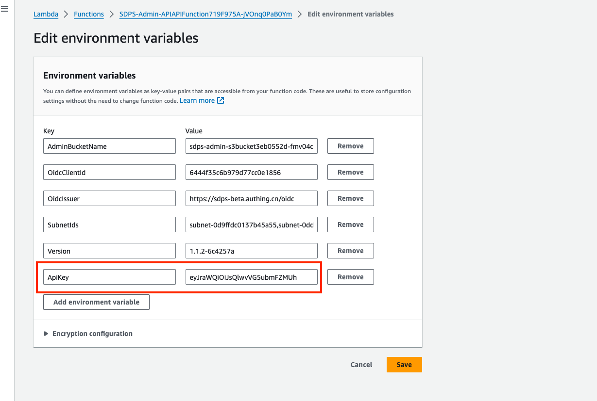

If you need to call the API to perform data detection, please configure the ApiKey in the environment variables of Lambda first. The system will verify the authenticity of the ApiKey through the specified field in the request header. For detailed instructions, please refer to this document.

## Custom Security Key

- Step 1: Log in to the AWS console, select the Lambda option, and enter the Lambda console.


- Step 2: Select the corresponding deployment region in the upper right corner, and enter the Functions list page.
- Step 3: Enter "APIAPIFunction" in the search box, and select the corresponding Function from the drop-down list.


- Step 4: Click on the Function name link to enter the Function page, then select the Configuration tab.
- Step 5: Select the Environment variables tab on the left side, click the edit button on the upper right corner of the right panel, and add environment variables.


- Step 6: On the environment variable editing page, add a key-value pair, with the key as the fixed value "ApiKey", and the value as the user-defined content. This value will be used for validation when accessing the API later.



## Security Verification

All API requests require security verification using an API key. Your API key should be included in the HTTP header of all API requests as x-api-key as follows:

```config
x-api-key: xxxxxxxxxxxxxxxxxxxx
```
