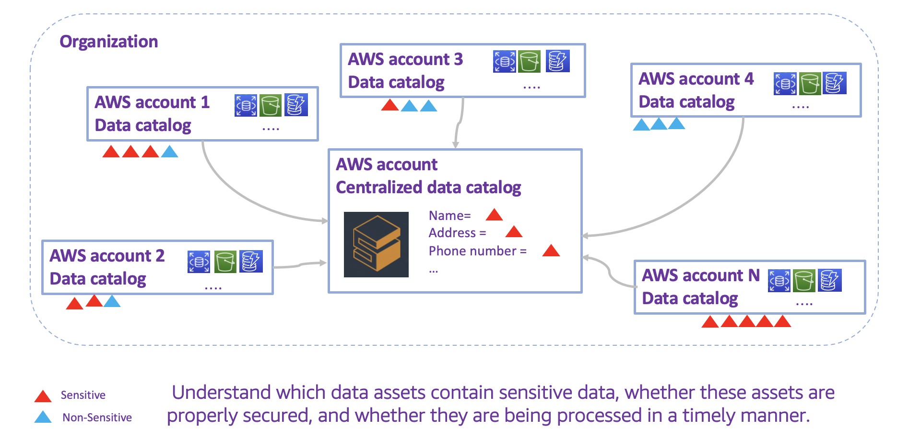

The Sensitive Data Protection on AWS solution allows enterprise customers to create data catalogs, discover, protect, and visualize sensitive data across multiple AWS accounts. The solution eliminates the need for manual tagging to track sensitive data such as Personal Identifiable Information (PII) and classified information. 

The solution provides an automated approach to data protection with a self-service web application. You can perform regular or on-demand sensitive data discovery jobs using your own data classification templates. Moreover, you can access metrics such as the total number of sensitive data entries stored in all your AWS accounts, which accounts contain the most sensitive data, and the data source where the sensitive data is located. 

The solution helps enterprise customers (such as companies with security or big data businesses) to implement the following data protection measures: 

- centralized management over hundreds of AWS accounts
- automatic discovery of data assets
- sensitive data detection and automatic labeling
- integration with other AWS services or application

This guide provides an overview of the solution, its reference architecture and components, considerations for planning the deployment, configuration steps for deploying the solution to the Amazon Web Services (AWS) Cloud. 

Use this navigation table to quickly find answers to these questions:

| If you want to … | Read… |
|----------|--------|
| Know the cost for running this solution | [Cost](plan-deployment/cost.md) |
| Understand the security considerations for this solution | [Security](plan-deployment/security.md) |
| Know which AWS Regions are supported for this solution | [Supported AWS Regions](plan-deployment/regions.md) |
| View or download the AWS CloudFormation template included in this solution to automatically deploy the infrastructure resources (the “stack”) for this solution | [AWS CloudFormation templates](deployment/template.md) |

The guide is intended for IT architects, developers, DevOps, data engineers with practical experience architecting on the AWS Cloud.
