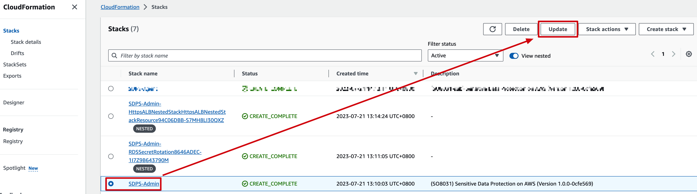
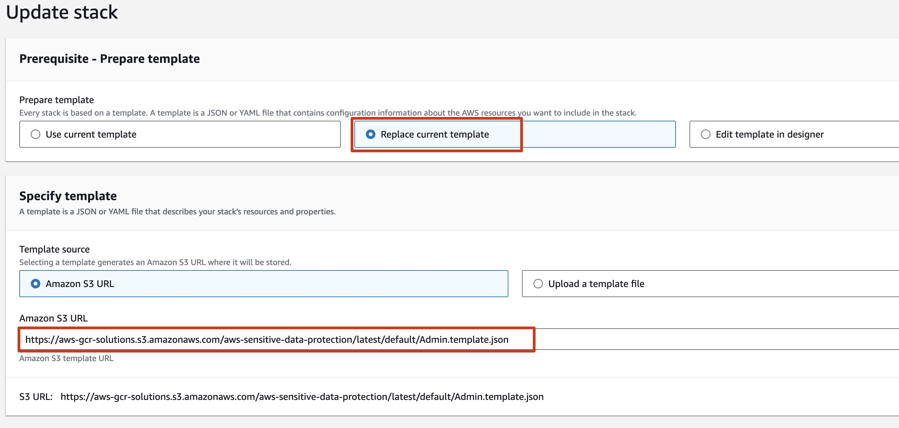
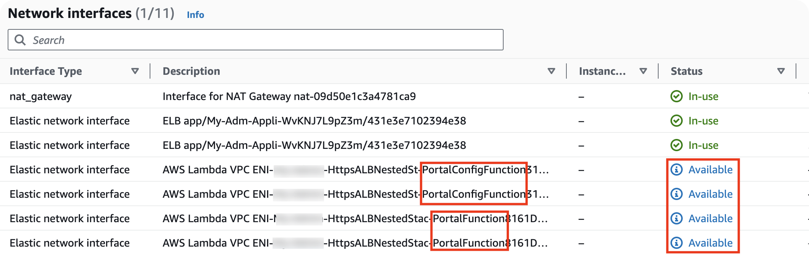

**Time to update**: Approximately 20 minutes

## Update overview
!!! Important "Important"
    Currently, upgrading from 1.0 to 1.1 is not supported. Please remove 1.0 and redeploy 1.1.
    If there is indeed a need, please contact us.
!!! Important "Important"
    Please confirm that no jobs are running before updating.
This page is used to guide how to update to the latest version after deploying an old version.
Use the following steps to update this solution on AWS. 

- Step 1.Update the **Admin** stack in admin account
- Step 2.Update the **Agent** stack in monitored account(s)

## Update steps

### Step 1. Update the admin stack
!!! Important "Important"
    The new template url must be consistent with the previous template url, otherwise the update will fail.  
    That is, the previous stack used the new VPC template, and the new stack must also use the new VPC template.Similarly, the previous stack used the existing VPC template, and the new stack must also use the existing VPC template.
1. Sign in to the AWS management console, enter the CloudFormation service, select the previously deployed stack, and then click the **Update** button.

2. Select **Replace Current Template**, then enter the template url in the **Amazon S3 URL** input box, and then click **Next**. Template Address Reference [CloudFormation template](../deployment/template.md).

3. On the **specified stack details** page, click **Next**.  
4. On the **Configure stack options** page, click **Next**.
5. On the **Review** page, review and confirm the settings. Select 3 checkboxes that I acknowledge.Choose **Create stack** to deploy the stack.
6. When upgrading from 1.1.0 to subsequent versions, please manually delete 4 ENIs with a status of **Available** after 5 minutes of CloudFormat update: 2 descriptions contain **PortalConfigFunction** and 2 descriptions contain **PortalFunction**。

7. Wait for about 20 minutes to ensure that all related resource are updated. You can choose the **Resource** and **Event** tab to see the status of the stack.
After the update is successful, you can reopen the administrator page.
!!! Important "Important"
    You need to manually delete ENI, otherwise the upgrade will fail.

### Step 2. Update the agent stack

The operation steps are the same as updating the admin stack. Please note that when entering the template url, simply enter the agent template url.
!!! Important "Important"

    The agent must be updated at the same time as the admin version, otherwise when the version does not match, the job(s) will run with an error.