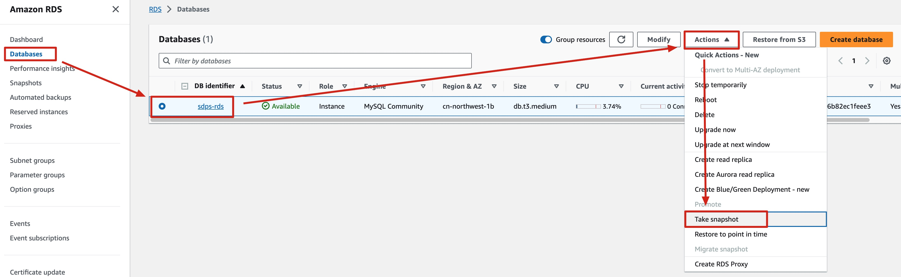
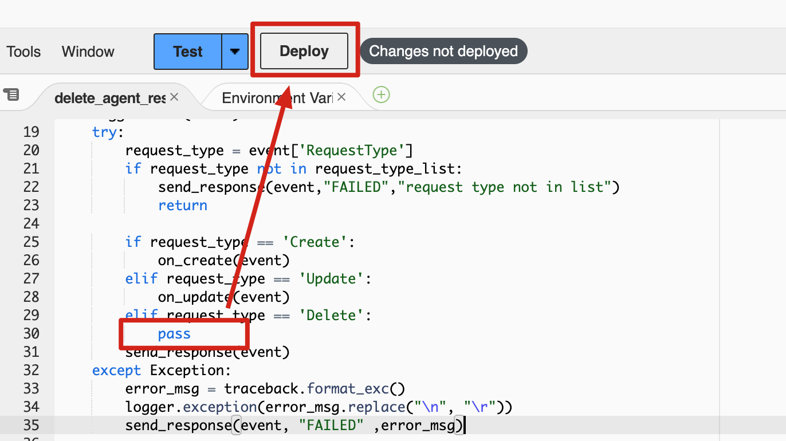

**Time to update**: Approximately 20 minutes

## Update overview
!!! Important "Important"
    Please confirm that no jobs are running before updating.
This page is used to guide how to update to the latest version after deploying an old version.
Use the following steps to update this solution on AWS. 

- Part I.Update the **Admin** stack in admin account
- Part II.Update the **Agent** stack in monitored account(s)

## Update steps

### Part I. Update the admin stack
!!! Important "Important"
    The new template url must be consistent with the previous template url, otherwise the update will fail.  
    That is, the previous stack used the new VPC template, and the new stack must also use the new VPC template.Similarly, the previous stack used the existing VPC template, and the new stack must also use the existing VPC template.
1. Back up the database. Sign in to the AWS management console, enter the RDS service, click on **Databases** in the navigation bar, then select **sdps-rds**, then click on **Action**, **Take Snapshot**, fill in the **Snapshot Name**, click **Take Snapshot**, wait until **Status** changes to **Available**, and then proceed to the next step.

1. Delete the **Agent** stack from the administrator account. If you have deployed the **Agent** stack in the administrator account, please follow this step, otherwise proceed to the next step.
    1. Enter the lambda service, click on **SDPS-DeleteAgentResources** to enter the code page.
    1. Modify the 30th line of the delete_agent_resources.py file to `pass`, and then click **deploy**.

    1. Enter the CloudFormation service, select the **Agent** stack, and click the **Delete** button
1. Enter the CloudFormation service, select the previously deployed stack, and then click the **Update** button.

2. Select **Replace Current Template**, then enter the template url in the **Amazon S3 URL** input box, and then click **Next**. Template Address Reference [CloudFormation template](../deployment/template.md).

3. On the **specified stack details** page, click **Next**.  
4. On the **Configure stack options** page, click **Next**.
5. On the **Review** page, review and confirm the settings. Select 3 checkboxes that I acknowledge.Choose **Create stack** to deploy the stack.   
Wait for about 10 minutes to ensure that all related resource are updated. You can choose the **Resource** and **Event** tab to see the status of the stack.
After the update is successful, you can reopen the administrator page.

### Part II. Update the agent stack
!!! Important "Important"
    The agent must be updated at the same time as the admin version, otherwise when the version does not match, the job(s) will run with an error.

Upgrading from 1.0.x to latest (currently 1.1.0) requires two upgrades.  
The operation steps are the same as updating the admin stack. Please note that when entering the template url, simply enter the agent template url.

1. For the first upgrade, the template url is as follows:
    - Global Regions：https://aws-gcr-solutions.s3.amazonaws.com/aws-sensitive-data-protection/1.1.0-transition/default/Agent.template.json
    - China Regions：https://aws-gcr-solutions.s3.cn-north-1.amazonaws.com.cn/aws-sensitive-data-protection/1.1.0-transition/cn/Agent.template.json)
2. After the first upgrade is completed, perform the second upgrade with the template url as follows:
    - Global Regions：https://aws-gcr-solutions.s3.amazonaws.com/aws-sensitive-data-protection/latest/default/Agent.template.json
    - China Regions：https://aws-gcr-solutions.s3.cn-north-1.amazonaws.com.cn/aws-sensitive-data-protection/latest/cn/Agent.template.json)