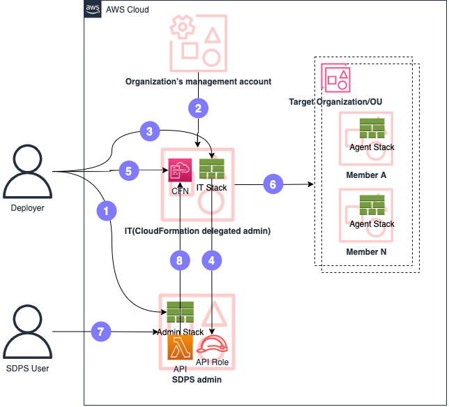

You can use [AWS Organizations](https://aws.amazon.com/organizations/) to manage automated deployment of monitored accounts. In AWS CloudFormation, you can configure [StackSet](https://docs.aws.amazon.com/AWSCloudFormation/latest/UserGuide/what-is-cfnstacksets.html) to deploy the Agent stack in the target Organizational Unit (OU). After you have configured the deployment, the Agent stack will be automatically deployed to the specified region of the account under the OU. Finally, you need to deploy the IT stack to the Organizations management account or the corresponding CloudFormation delegated account under Organizations, then, you can add member accounts [via Organizations](../user-guide/data-source.md#add-aws-accounts-via-organization).

## Steps

1. Deploy Admin CloudFormation stack in the Admin account.
2. Register delegated administrator in StackSets in Organization’s management account. For more information, refer to [Register a delegated administrator](https://docs.aws.amazon.com/AWSCloudFormation/latest/UserGuide/stacksets-orgs-delegated-admin.html).
3. Deploy IT CloudFormation Stack.
4. Create a role for the solution Admin API.
5. Create StackSet for Agent CloudFormation Stack.
6. Deploy to Organization/OU(s).
7. Add member account [via Organizations](../user-guide/data-source.md#add-aws-accounts-via-organization).
8. Retrieve deployment stacks and member accounts.