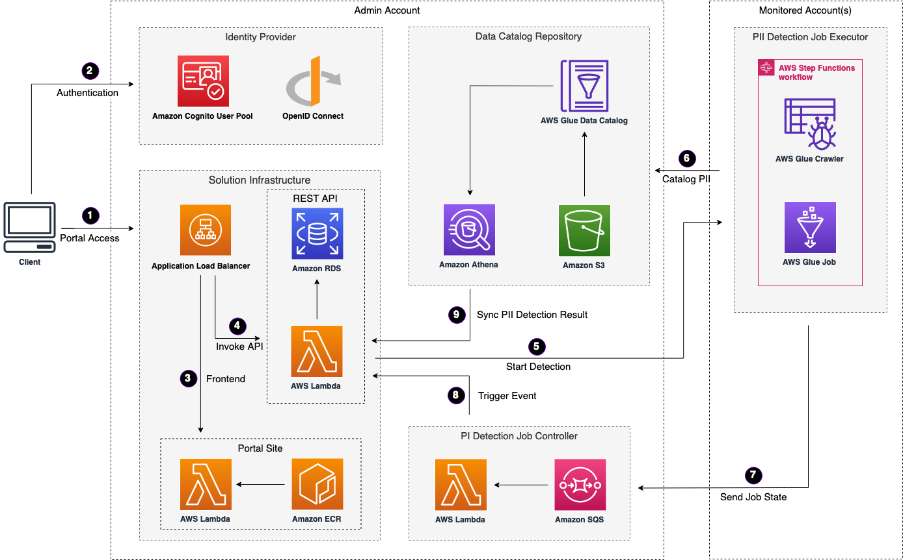

使用默认参数部署此解决方案将在AWS云中构建以下环境。

**AWS上的敏感数据保护架构**

1. [应用负载均衡器](https://aws.amazon.com/alb/)用于分发托管在[AWS Lambda](https://aws.amazon.com/lambda/)中的解决方案前端Web UI资源。
2. 身份提供者用于用户身份验证。
3. AWS Lambda函数打包为Docker镜像，并存储在[Amazon ECR（弹性容器注册表）](https://aws.amazon.com/ecr/)中。
4. 后端Lambda函数是应用负载均衡器的目标。
5. 后端Lambda函数调用监控账户中的[AWS Step Functions](https://aws.amazon.com/step-functions/)来进行敏感数据检测。
6. 在[AWS Step Functions](https://aws.amazon.com/step-functions/)工作流中，[AWS Glue](https://aws.amazon.com/glue/) Crawler运行以列出数据源，并将其作为元数据表存储在Glue数据库中。
7. Glue作业运行后，Step Functions会将消息发送到[Amazon SQS（简单队列服务）](https://aws.amazon.com/sqs/)中的检测作业队列。
8. Lambda函数从Amazon SQS中处理消息。
9. [Amazon Athena](https://aws.amazon.com/athena/)查询检测结果，并将其保存到[Amazon RDS（关系型数据库服务）](https://aws.amazon.com/rds/)中的MySQL实例中。

该解决方案使用AWS Glue服务作为构建受监控账户中的数据目录和调用Glue作业以检测敏感数据个人身份识别信息（PII）的核心。分布式的Glue作业在每个受监控的账户中运行，而管理员账户包含了跨AWS账户的集中式数据源数据目录。这是AWS推荐的数据网格（Data Mesh）概念的一种实现方式。

更具体地说，该解决方案引入了事件驱动的流程，并使用AWS IAM角色在管理员账户和受监控账户之间触发和通信以进行敏感数据发现作业。管理员账户可以启动PII检测作业并检索数据目录。所有受监控的AWS账户都被允许连接到管理员账户，管理员账户能够区分和访问这些受监控的账户。