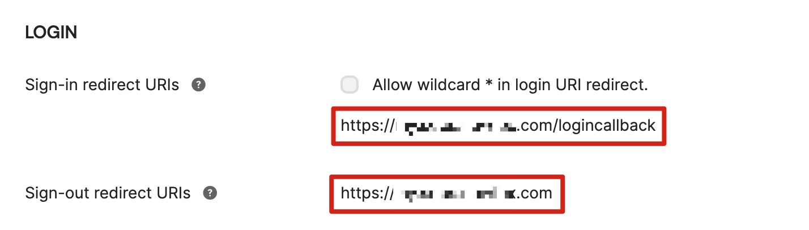

在启动解决方案之前，请仔细阅读本指南中讨论的架构、支持的区域以及其他考虑事项。按照本节中的逐步说明来配置和部署解决方案到您的账户中。

**部署所需时间**：大约30分钟

## 部署概述

按照以下步骤在AWS上部署此解决方案。

- 步骤一：创建OIDC应用程序（使用带身份提供商的模板可跳过此步）
- 步骤二：将AWS CloudFormation的**Admin**模板部署到您的AWS管理员账户
- 步骤三：配置OIDC应用程序（使用带身份提供商的模板可跳过此步）
- 步骤四：配置自定义域名
- 步骤五：访问控制台
- 步骤六：将AWS CloudFormation的**Agent**模板部署到需要检测的AWS账户

## 部署步骤

### 步骤一：创建OIDC应用程序
!!! Info "提醒"
    使用带身份提供商的模板可跳过此步
您可以使用不同类型的OpenID Connector（OIDC）提供者。本节介绍了选项1到选项3的选项。

- 选项 1：Cognito，使用Amazon Cognito作为OIDC提供者。

- 选项 2：Authing，这是一个第三方认证提供者的示例。

- 选项 3：OKTA，这是一个第三方认证提供者的示例。

#### 选项 1：Cognito
您可以在支持的AWS区域中利用[Cognito用户池](https://docs.aws.amazon.com/cognito/latest/developerguide/cognito-user-identity-pools.html)作为OIDC提供者。

1. 访问[Amazon Cognito控制台](https://us-east-1.console.aws.amazon.com/cognito/v2/idp/user-pools/create?region=us-east-1)。

2. 根据此[指南](https://docs.aws.amazon.com/cognito/latest/developerguide/cognito-user-pools-app-integration.html#cognito-user-pools-create-an-app-integration)，使用Amazon Cognito控制台设置托管的UI。

3. 创建用户池时，从步骤1到步骤4，根据您的需要进行配置。

4. 请确保您在**托管身份验证页面**区域选择了**使用 Cognito 托管 UI**。在选择**App类型**时选择**Public client**。在选择**Client secret**时选择**Don't generate a client secret**。

5. 在**高级应用客户端设置**中，设置**OpenID Connect scopes**时选择**OpenID**、**Email**和**Profile**。

5. 确认**托管的UI状态**为**Available**。确保**OpenID Connect scopes**包括**email**、**openid**和**profile**。

6. 将应用的**Client ID**、**User pool ID**和**AWS区域**保存到一个文件中，稍后将用到。在**步骤二：部署管理员堆栈（Deploy admin stack）**中，**Client ID**即为应用的**Client ID**，**Issuer URL**为`https://cognito-idp.${REGION}.amazonaws.com/${USER_POOL_ID}`

注意：该页面配置的参数**Allowed callback URLs**和**Allowed sign-out URLs**将会在**步骤三：配置 OIDC 应用**中重新配置.

#### 选项 2：Authing
1. 转到[Authing控制台](https://www.authing.cn/)。

2. 在左侧导航栏中，选择Applications下的Self-built App。

3. 点击创建按钮。

4. 输入Application Name和Subdomain。

5. 从Endpoint Information中保存**App ID**（即Client ID）和**Issuer**（Issuer URL）到一个文本文件中，稍后将用到。

6. 在**Protocol Configuration**选项卡中设置**Authorization Configuration**。

7. 在访问授权选项卡中，选择可访问的用户。

#### 选项 3：OKTA
1. 转到[OKTA控制台](https://developer.okta.com/login/)。

2. 点击Applications → Create App Integration

3. 选择**OIDC - OpenID Connect** → 选择**Single-Page Application** → 点击**Next**

4. 在受控访问中，选择适合您的方式。

5. 从Endpoint Information中将Client ID和Issuer URL保存到一个文本文件中，稍后将用到。  
Issuer URL可以在您的个人资料中找到。完整的Issuer URL为“https://dev-xxx.okta.com”。
  

### 步骤二：部署管理员堆栈（Deploy admin stack）

1. 登录到AWS管理控制台，并使用以下按钮启动 AWS CloudFormation 模板。

   |                                       | 从 AWS 控制台中启动                                                                                                                                                                                                                                                            |
    |----------------------------------------------------------------------------------------------------------------------------------------------------------------------------------------------------------------------------------------------------------------------------------| ------------------------- |
    | 在新VPC （AWS全球区域）中启动解决方案       | {target=_blank}                               |
    | 在现有VPC （AWS全球区域）中启动解决方案 | {target=_blank}                |
    | 在新VPC（AWS 中国区域）中启动解决方案                 | {target=_blank}                                 |
    | 在现有VPC（AWS 中国区域）中启动解决方案           | {target=_blank} |

!!! Important "重要提示"

    使用现有VPC必须满足以下条件：
                    
    - 至少有两个公有子网和两个私有子网。
    - 该VPC必须有NAT gateway。 
    - 两个私有子网都有到NAT gateway的路由。

2. 要在不同的AWS区域中启动此解决方案，请使用控制台导航栏中的区域选择器。
3. 在**Create stack**页面上，验证**Amazon S3 URL**文本框中显示的正确模板URL，并选择**Next**。
4. 在**Specify stack details**页面上，为解决方案堆栈分配一个有效且账户级唯一的名称。
5. 在**Parameters**下，查看模板的参数并根据需要进行修改。该解决方案使用以下默认值。

    |      参数       |    默认值    |                                                      描述                                                      |
    |:---------------:|:-----------:|:------------------------------------------------------------------------------------------------------------|
    |Issuer URL||指定安全的OpenID Connect URL。最大长度为255个字符。URL必须以"https://"开头|
    |Client ID||指定身份提供商颁发的客户端ID。最大长度为255个字符。使用字母数字或?:_.-/?字符 |
    |Public Access | Yes |如果选择No，则只能在VPC中访问门户网站。如果要通过Internet访问门户网站，需要选择Yes |
    |Port|80|如果已添加ACM证书ARN，建议使用默认端口443作为HTTPS协议的端口。否则，可以将端口设置为80作为备用选项|
    |ACM Certificate ARN||(可选)为了通过加密实现安全通信并增强解决方案的安全性，可以添加来自ACM的公共证书ARN，以基于HTTPS协议创建门户网站URL|
    |Custom Domain Name||(可选)通过添加您自己的域名（例如sdps.example.com），您可以在部署堆栈后通过将CNAME记录添加到该域名来直接访问门户网站。只填写域名，不要填写http(s) |

6. 选择**Next**。
7. 在**Configure stack options**页面上，选择**Next**。
8. 在**Review**页面上，查看并确认设置。选中3个“我确认”的复选框。
9. 选择**Create stack**以部署堆栈。  
等待约20分钟，以确保创建了所有相关资源。您可以选择“资源”和“事件”选项卡查看堆栈的状态。
10. 在“输出”选项卡中，您将看到门户网站的URL和SigninRedirectUri。

### 步骤三：配置OIDC应用程序（Configure OIDC application）

!!! Info "提醒"
    使用带身份提供商的模板可跳过此步
将SigninRedirectUriHTTP(S)和PortalUrlHTTP(S)的值分别填入您的OIDC应用程序中的登录回调地址和退出回调地址中。
#### 选项 1：Cognito

1. 访问您的用户池。
2. 选择**App integration**。
3. 选择**Your App**。
4. 进行以下配置。

#### 选项 2：Authing

#### 选项 3：OKTA

### 步骤四：配置自定义域名（Configure custom domain name）

如果在创建堆栈时填写了自定义域名，请将自定义域名的CName设置为CloudFormation输出选项卡中的LoadBalancerDnsNameHTTP(S)值。

1. 从**Outputs**选项卡中获取**LoadBalancerDnsNameHTTP(S)**作为终端节点。
2. 在DNS解析器中创建一个指向终端地址的CNAME记录。

### 步骤五：访问控制台

1. 从**Outputs**选项卡中获取**PortalUrlHTTP(S)**的值。
2. 在浏览器中输入该值，启动解决方案的控制台。

### 步骤六：部署Agent堆栈（Deploy agent stack）

您可以选择一个或多个账户部署Agent堆栈，从而检测敏感数据。

1. 登录AWS管理控制台，并使用下面的按钮启动AWS CloudFormation模板。

    |                                       | 从 AWS 控制台中启动                                                                                                                                                                                                                                                            |
    |----------------------------------------------------------------------------------------------------------------------------------------------------------------------------------------------------------------------------------------------------------------------------------| ------------------------- |
    | 从AWS全球区域部署 Agent template       | {target=_blank}                               |
    | 从AWS中国区域部署 Agent template                  | {target=_blank}                                 |

2. 要在其他AWS区域中启动此解决方案，请使用控制台导航栏中的区域选择器。
3. 在创建堆栈页面上，确认在Amazon S3 URL文本框中显示了正确的模板URL，并选择下一步。
4. 在指定堆栈详细信息页面上，输入一个堆栈名称。
5. 在Admin Account ID字段中，输入管理员帐户的帐户ID（12位数字）。这意味着此帐户将成为由指定的管理员帐户监控的帐户。
6. 按照**步骤二：部署Admin堆栈**中描述的剩余步骤完成Agent堆栈的部署。