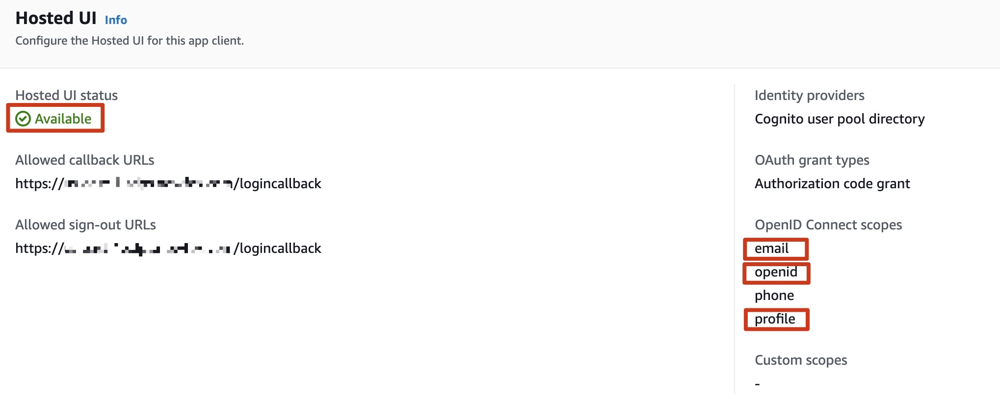
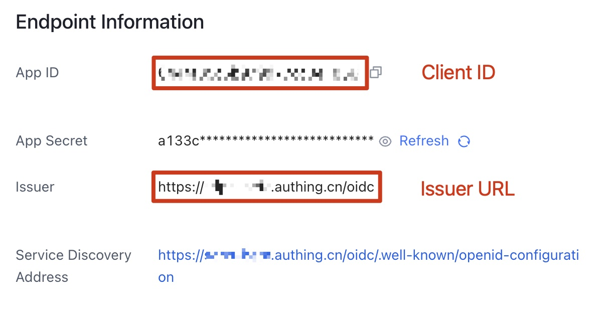

在启动解决方案之前，请仔细阅读本指南中讨论的架构、支持的区域以及其他考虑事项。按照本节中的逐步说明来配置和部署解决方案到您的账户中。

**部署所需时间**：大约30分钟

## 部署概述

按照以下步骤在AWS上部署此解决方案。

- 创建用户池和OIDC应用程序。
- 将AWS CloudFormation的**管理员（Admin）**模板部署到您的AWS管理员账户。
- （可选）如果您的账户都属于AWS组织，请在IT账户下部署**IT**模板。AWS组织根账户需要首先将IT账户注册为委派管理员。
- 将AWS CloudFormation的**代理（Agent）**模板部署到需要检测的AWS账户。

## 部署步骤

### 创建用户池和OIDC应用程序

您可以使用不同类型的OpenID Connector（OIDC）提供者。本节介绍了Option 1到Option 3的选项。

- Option 1：使用Amazon Cognito作为OIDC提供者。

- Option 2：Authing，这是一个第三方认证提供者的示例。

- Option 3：OKTA，这是一个第三方认证提供者的示例。

#### Option 1：Cognito
您可以在支持的AWS区域中利用[Cognito用户池](https://docs.aws.amazon.com/cognito/latest/developerguide/cognito-user-identity-pools.html)作为OIDC提供者。
1. 在AWS标准区域中，转到[Amazon Cognito控制台](https://us-east-1.console.aws.amazon.com/cognito/v2/idp/user-pools/create?region=us-east-1)。

2. 根据此[指南](https://docs.aws.amazon.com/cognito/latest/developerguide/cognito-user-pools-app-integration.html#cognito-user-pools-create-an-app-integration)，使用Amazon Cognito控制台设置托管的UI。

3. 在选择**App类型**时选择**Public client**。在选择**Client secret**时选择**Don't generate a client secret**。

4. 在**高级应用客户端设置**中，设置**OpenID Connect scopes**时选择**OpenID**、**Email**和**Profile**。

5. 确认**托管的UI状态**为**Available**。确保**OpenID Connect scopes**包括**email**、**openid**和**profile**。

6. 将应用的**Client ID**、**User pool ID**和**AWS区域**保存到一个文件中，稍后将用到。
在下一节**部署管理员堆栈（Deploy admin stack）**中，**Client ID**即为应用的**Client ID**，**Issuer URL**为`https://cognito-id

p.${REGION}.amazonaws.com/${USER_POOL_ID}`

#### Option 2：Authing
1. 转到[Authing控制台](https://www.authing.cn/)。

2. 在左侧导航栏中，选择Applications下的Self-built App。

3. 点击创建按钮。

4. 输入Application Name和Subdomain。

5. 从Endpoint Information中保存**App ID**（即Client ID）和**Issuer**（Issuer URL）到一个文本文件中，稍后将用到。

6. 在**Protocol Configuration**选项卡中设置**Authorization Configuration**。

7. 在访问授权选项卡中，选择可访问的用户。

#### Option 3：OKTA
1. 转到[OKTA控制台](https://developer.okta.com/login/)。

2. 点击Applications → Create App Integration

3. 选择**OIDC - OpenID Connect** → 选择**Single-Page Application** → 点击**Next**

4. 在受控访问中，选择适合您的方式。

5. 从Endpoint Information中将Client ID和Issuer URL保存到一个文本文件中，稍后将用到。  
Issuer URL可以在您的个人资料中找到。完整的Issuer URL为“https://dev-xxx.okta.com”。
  

### 部署管理员堆栈（Deploy admin stack）

1. 登录到AWS管理控制台，并使用以下全局区域模板（New VPC）[链接](https://aws-gcr-solutions.s3.amazonaws.com/aws-sensitive-data-protection/1.0.0/default/Admin.template.json)或中国区域模板（New VPC）[链接](https://aws-gcr-solutions.s3.cn-north-1.amazonaws.com.cn/aws-sensitive-data-protection/1.0.0/cn/Admin.template.json)来启动AWS CloudFormation模板。
2. 要在不同的AWS区域中启动此解决方案，请使用控制台导航栏中的区域选择器。
3. 在**Create stack**页面上，验证**Amazon S3 URL**文本框中显示的正确模板URL，并选择**Next**。
4. 在**Specify stack details**页面上，为解决方案堆栈分配一个有效且账户级唯一的名称。
5. 在**Parameters**下，查看模板的参数并根据需要进行修改。该解决方案使用以下默认值。

    |      参数       |    默认值    |                                                      描述                                                      |
    |:---------------:|:-----------:|:------------------------------------------------------------------------------------------------------------|
    |Issuer URL||指定安全的OpenID Connect URL。最大长度为255个字符。URL

必须以"https://"开头|
    |Client ID||指定身份提供商颁发的客户端ID。最大长度为255个字符。使用字母数字或?:_.-/?字符 |
    |Public Access | Yes |如果选择No，则只能在VPC中访问门户网站。如果要通过Internet访问门户网站，需要选择Yes |
    |Port|80|如果已添加ACM证书ARN，建议使用默认端口443作为HTTPS协议的端口。否则，可以将端口设置为80作为备用选项|
    |ACM Certificate ARN||(可选)为了通过加密实现安全通信并增强解决方案的安全性，可以添加来自ACM的公共证书ARN，以基于HTTPS协议创建门户网站URL|
    |Custom Domain Name||(可选)通过添加您自己的域名（例如sdps.example.com），您可以在部署堆栈后通过将CNAME记录添加到该域名来直接访问门户网站。只填写域名，不要填写http(s)://|

6. 选择**Next**。
7. 在**Configure stack options**页面上，选择**Next**。
8. 在**Review**页面上，查看并确认设置。选中3个“我承认”的复选框。
9. 选择**Create stack**以部署堆栈。  
等待约20分钟，以确保创建了所有相关资源。您可以选择“资源”和“事件”选项卡查看堆栈的状态。
10. 在“输出”选项卡中，您将看到门户网站的URL和SigninRedirectUri。

### 配置OIDC应用程序（Configure OIDC application）

将SigninRedirectUriHTTP(S)的值复制并配置到您的OIDC应用程序中。
#### Option 1：Cognito
**Your user pools** -> **App integration** -> **Your App**

#### Option 2：Authing

#### Option 3：OKTA

### 配置自定义域名（Configure custom domain name）

如果在创建堆栈时填写了自定义域名，请将自定义域名的CName设置为CloudFormation输出选项卡中的LoadBalancerDnsNameHTTP(S)值。

### 打开解决方案门户（Open the solution portal）

门户网站是CloudFormation输出选项卡上的**PortalUrlHTTP(S)**的值。

### 部署Agent堆栈（Deploy agent stack）

安装步骤与管理员堆栈相同。

[中国区域agent模板](https://aws-gcr-solutions.s3.cn-north-1.amazonaws.com.cn/aws-sensitive-data-protection/1.0.0/cn/Agent.template.json)

[标准区域agent模板](https://aws-gcr-solutions.s3.amazonaws.com/aws-sensitive-data-protection/1.0.0/default/Agent.template.json)

在步骤4中，输入的**AdminApiEndpoint**是您部署的管理员堆栈的**Endpoint**。