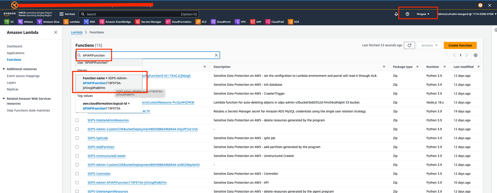
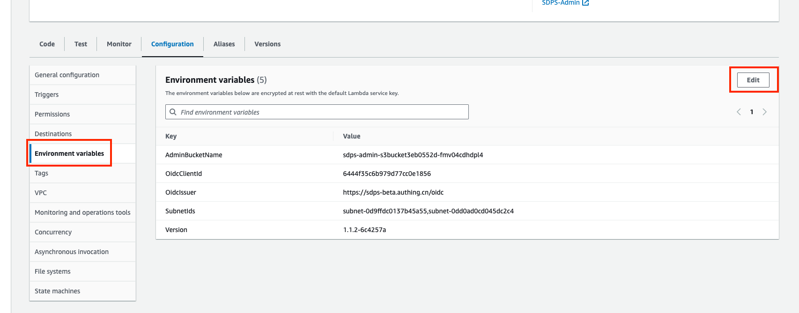
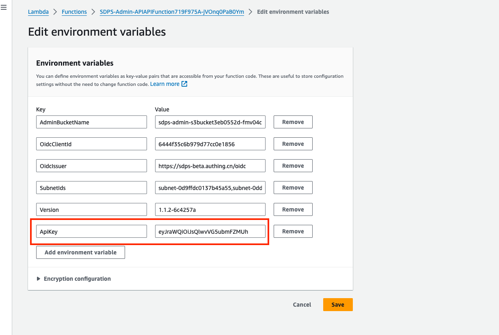

如果需要调用API实现数据检测，请先在lambda的环境变量里配置ApiKey,系统会通过请求头里面的指定字段验证ApiKey的真实性，具体操作请参考本文档。

## 自定义安全密钥

- 步骤一：登录aws后台，选择lambda选项，进入lambda控制台


- 步骤二：选择右上角对应的部署region, 进入Functions列表页
- 步骤三： 在搜索框里输入APIAPIFunction,在下拉列表中选择命中的Function



- 步骤四： 点击Function name链接，进入该Function页面，选中进入 Configuration 标签页
- 步骤五： 选中左侧的Environment variables标签，点击右边面板右上角的edit按钮，添加环境变量



- 步骤六： 在环境变量编辑页面，新增key-value，key为固定值“ApiKey”，value为用户自定义的内容，后续访问api的时候会以这个value值做校验



## 安全验证

所有 API 使用 API 密钥进行安全验证，所有 API 请求都应在 HTTP 标头中包含您的 API 密钥，`x-api-key` 如下所示：

```config
x-api-key: xxxxxxxxxxxxxxxxxxxx
```
