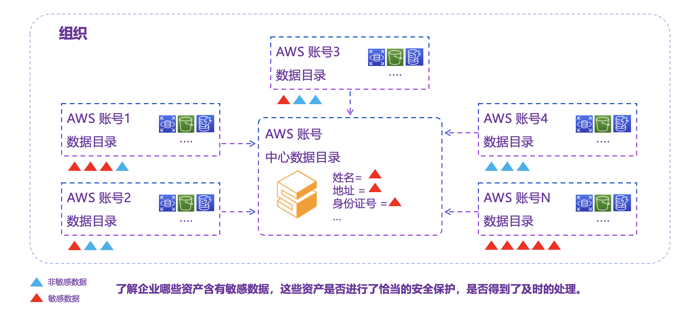

敏感数据保护解决方案（Sensitive Data Protection on AWS, SDP）允许企业客户创建数据目录，发现、保护和可视化多个 AWS 账户中的敏感数据。该解决方案让您不必手动标记以跟踪敏感数据（如个人身份信息（PII）和分类信息）。

该解决方案提供了一种自助式 Web 应用程序的自动化数据保护方法。您可以使用自己的数据分类模板执行定期或按需敏感数据发现作业。此外，您可以访问诸如所有 AWS 账户中存储的敏感数据条目总数、包含最多敏感数据的账户以及敏感数据所在的数据源等指标。

该解决方案帮助企业客户（如涉及安全或大数据业务的公司）实施以下数据保护措施：

- 对数百个 AWS 账户进行集中管理
- 自动发现数据资产
- 敏感数据检测和自动标记
- 与其他 AWS 服务或应用程序集成

本指南提供了解决方案、其参考架构和组件、部署规划考虑因素以及将解决方案部署到 Amazon Web Services (AWS) 云端的配置步骤的概述。

使用此导航表快速查找这些问题的答案：

| 如果您想要…… | 阅读…… |
|----------|--------|
| 了解运行此解决方案的成本 | [成本](./plan-deployment/cost.md) |
| 了解此解决方案的安全考虑因素 | [安全](./plan-deployment/security.md) |
| 了解此解决方案支持哪些 AWS 区域 | [支持部署的 AWS 区域](./plan-deployment/regions.md) |
| 查看或下载此解决方案中包含的 AWS CloudFormation 模板，以自动部署此解决方案的基础设施资源（“堆栈”） | [AWS CloudFormation 模板](./deployment/template.md) |

本指南面向具有在 AWS 云上架构实践经验的 IT 架构师、开发人员、DevOps 和数据工程师。