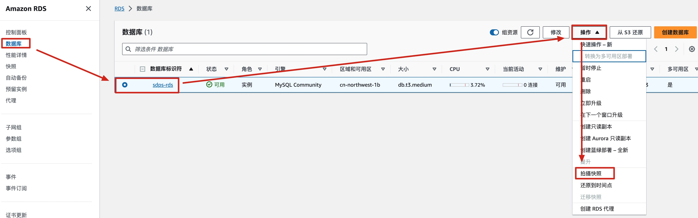
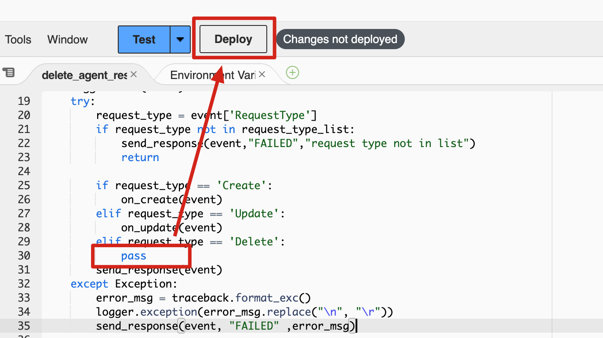

**升级所需时间**：大约20分钟

## 升级概述
!!! Important "重要提示"
    请在更新前确认没有任何任务在运行。
本页用于指导已部署老版本，如何升级到最新版本。
按照以下步骤在AWS上升级此解决方案。

- 第一部分：在您的AWS管理员账户中，升级**Admin**堆栈
- 第二部分：在被监控账户中，升级**Agent**堆栈

## 升级步骤

### 第一部分：升级管理员堆栈
!!! Important "重要提示"
    更新堆栈模板地址必须和原堆栈模板地址保持一致，否则会升级失败。  
    即：原堆栈使用新建VPC模板，新堆栈也必须使用新建VPC模板；同样，原堆栈使用现有VPC模板，新堆栈也必须使用现有VPC模板
1. 备份数据库。登录到AWS管理控制台，进入到RDS服务，点击导航栏的**数据库**，然后选择**sdps-rds**，再依次点击**操作**、**拍摄快照**，填入**快照名称**后，点击**拍摄快照**，待**状态**变为**可用**后，再执行下一步。

1. 删除管理员账号中的**Agent**堆栈。如果在管理员账号中部署了**Agent**堆栈，请执行本步骤，否则进入下一步。
    1. 进入到lambda服务，点击**SDPS-DeleteAgentResources**，进入到代码页面。
    1. 修改delete_agent_resources.py第30行为`pass`，然后点击**deploy**。

    1. 进入到CloudFormation服务，选择**Agent**堆栈，点击**删除**按钮
1. 进入到CloudFormation服务，选择以前部署的堆栈，再点击**更新**按钮。

2. 选择**替换当前模板**，然后在**Amazon S3 URL**输入框中输入对应的模板，然后点击**下一步**。模板地址参考[模板信息](../deployment/template.md)。

3. 在**指定堆栈详细信息**页面上，各个参数保持不变，然后点击**下一步**。  
4. 在**配置堆栈选项**页面上，各个参数保持不变，然后点击**下一步**。  
5. 在**审核**页面上，查看并确认设置。选中3个“我确认”的复选框，点击**提交**按钮以更新堆栈。  
等待约10分钟，以确保成功更新了所有相关资源。您可以选择“资源”和“事件”选项卡查看堆栈的状态。  
更新成功后，即可重新打开管理员页面。

### 第二部分：升级Agent堆栈
!!! Important "重要提示"
    Agent必须和管理员版本同时升级，否则版本不匹配时，任务运行会报错。

从1.0.x升级到latest（当前为1.1.0）的，需要升级2次。  
操作步骤和升级管理员堆栈相同，注意在输入模板地址时，输入Agent模板地址即可。

1. 第1次升级，模板地址如下：
    - 全球区域：https://aws-gcr-solutions.s3.amazonaws.com/aws-sensitive-data-protection/1.1.0-transition/default/Agent.template.json
    - 中国区域：https://aws-gcr-solutions.s3.cn-north-1.amazonaws.com.cn/aws-sensitive-data-protection/1.1.0-transition/cn/Agent.template.json)
2. 待第1次升级完毕后，再执行第2次升级，模板地址如下：
    - 全球区域：https://aws-gcr-solutions.s3.amazonaws.com/aws-sensitive-data-protection/latest/default/Agent.template.json
    - 中国区域：https://aws-gcr-solutions.s3.cn-north-1.amazonaws.com.cn/aws-sensitive-data-protection/latest/cn/Agent.template.json)
