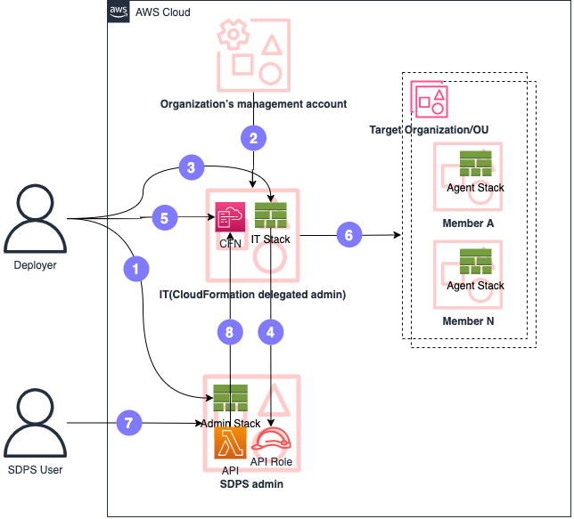

您可以使用 [AWS Organizations](https://aws.amazon.com/organizations/) 管理监控帐户的自动化部署。在 AWS CloudFormation 中，您可以配置 [StackSet](https://docs.aws.amazon.com/AWSCloudFormation/latest/UserGuide/what-is-cfnstacksets.html) 在目标组织单元（OU）中部署 Agent 堆栈。配置部署后，Agent 堆栈将自动部署到 OU 下帐户的指定区域。最后，您需要将 IT 堆栈部署到 Organizations 管理帐户或 Organizations 下的相应 CloudFormation 委托帐户，然后，您可以通过 Organizations [添加成员帐户](../user-guide/data-source.md#add-aws-accounts-via-organization)。

## 概念

1. 在 adminaccount 中部署 Admin CloudFormation 堆栈
2. 在组织管理帐户中的 StackSets 中注册委托管理员。[注册委托管理员](https://docs.aws.amazon.com/AWSCloudFormation/latest/UserGuide/stacksets-orgs-delegated-admin.html)
3. 部署 IT CloudFormation 堆栈
4. 为 SDPS Admin API 创建角色
5. 为 Agent CloudFormation 堆栈创建 StackSet
6. 部署到组织/OU
7. 通过组织[添加成员帐户](../user-guide/data-source.md#add-aws-accounts-via-organization)
8. 检索部署堆栈和成员帐户