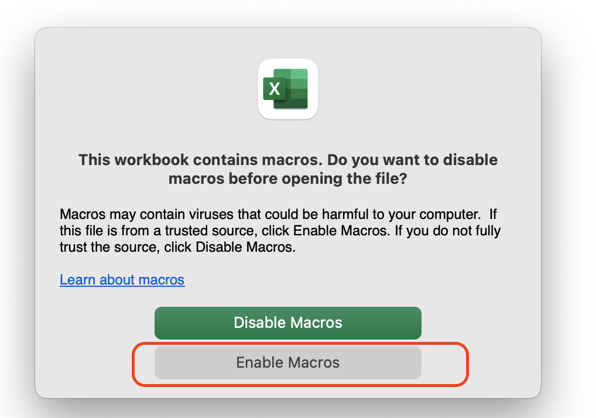

# 连接到数据源 - JDBC

当您希望对某一种数据库进行敏感数据扫描时，您可以将DB instance或databases作为数据源。

首先，请确认您[添加AWS账户](data-source.md)时，选择的是CloudFormation方式。如果您添加账户时，选择JDBC方式，请转至[通过EC2代理连接数据库](data-catalog-create-jdbc-database-proxy.md)进行操作。

当前支持的JDBC数据源

| 支持的数据库类型      |
|-----------------------|
| Amazon Redshift       |
| Amazon Aurora         |
| Microsoft SQL Server  |
| MySQL                 |
| Oracle                |
| PostgreSQL            |
| Snowflake             |
| Amazon RDS for MariaDB|

### 前提条件 - 保持网络连通性

1. 请确保待检测数据库的inbound rule上有所在安全组的自引用, 操作详见[官网文档](https://docs.aws.amazon.com/glue/latest/dg/setup-vpc-for-glue-access.html)。
2. 准备好数据库连接凭证（用户名/密码）

!!! Info "如何获得JDBC凭证"
    DBA或业务方创建一个只读的用户（User）做安全审计使用。授予此用户只读权限：`GRANT SHOW VIEW, SELECT ON *.* TO 'reader'@'%'`;

## 连接单个JDBC数据源
1. 从左侧菜单，选择 **连接数据源** 
2. 选择**AWS Cloud**标签页
3. 单击进入一个AWS帐户，打开详细页面
4. 选择 **自定义数据库（JDBC）** 标签页。
5. 点击**操作**，**添加数据源**
6. 在弹出窗口中，输入数据库凭证信息。（如果您选择Secret Manager方式，需要提前将用户名/密码托管在Secret Manager。）
 
    | 参数               | 必填项  | 参数描述                                                                                                               |
    |-------------------|--------|--------------------------------------------------------------------------------------------------------------------|
    | 实例名称            | 是      | 数据库名称                                                                                                           |
    | 勾选SSL连接         | 否      | 是否通过SSL连接                                                                                                         |
    | 描述（选填）         | 否      | 实例描述                                                                                                               |
    | 数据库类型        | 是      | 选择MySQL 还是其他。如果是MySQL，方案支持自动查询实例中的数据库。若其他，您需要手动添加DB列表。                                                                                                               |
    | JDBC URL（必填）    | 是      | 填写一个database，用于连接和扫描。具体格式请参见本文最下面“JDBC URL格式以及样例”。|
    | JDBC数据库   | 否      | 如果您希望在一个数据目录展示多个数据库，则填写数据库列表。例如，1个数据目录为1个数据库实例，您可以填写instance下多个数据库。如果您只希望扫描此instance下一个数据库，则保留为空。 |
    | 凭证               | 是      | 选择用户名密码或SecretManager。填写数据库的用户名/密码。 |
    | VPC  | 是      | 选择数据库所在的VPC |                          
    | 子网  | 是      | 选择数据库所在的VPC子网 | 
    | 安全组  | 是      | 选择数据库所在的VPC安全组 |   

7. 点击 **授权**。您可以等待10s关闭此窗口。
8. 您看到目录状态变为蓝色`AUTHROZIED`（已授权）。这也意味着在SDP后台，AWS Glue已经成功创建Crawler。
   
**至此，您已经以JDBC方式连接到此数据源了🎉。您可以开始下一步操作👉[定义分类分级模版](data-identifiers.md)。** 

当您配置完分类模版，并运行完敏感数据发现任务。

- 若任务成功：您会在此数据源页面看到目录状态为绿色 `ACTIVE`，则表示已为该数据创建了数据目录。
- 若任务失败：您会在此数据源页面看到目录状态灰色`Error message`，你可以将鼠标放在错误上面看到具体信息。

## 批量自动创建JDBC数据源

如果您有很多的数据源，在UI上一个一个添加数据源不是很方便，此时，您可以使用这个批量创建的功能。

### Step 1: 下载模版
在AWS账号管理页面，点击**批量创建**按钮。
在批量操作页面，首先下载“批量创建数据源”模版(.xlsm)。

### Step 2: 编辑模版文件
用Microsoft Excel打开这个文件。Excel软件会提示，“是否需要Enabled Marcos？”，选择Enable。

填入您所需要扫描的数据源，建议少量多次（方便排查错误）。

| InstanceName        | SSL | Description                                                        | JDBC_URL                                     | JDBC_Databases | SecretARN | Username | Password   | AccountID            | Region         | ProviderID |
|---------------------|-----|--------------------------------------------------------------------|----------------------------------------------|----------------|-----------|----------|------------|----------------------|----------------|------------|
| test-instance-7001  | 1   | xxxx1.sql.db.com:23297 | jdbc:mysql://172.31.48.6:7001                |                |           | root     | Temp123456! | 123456789 | ap-guangzhou-1 | 1          |
| test-instance-7002  | 1   | xxxx2.sql.db.com:3306 | jdbc:mysql://172.31.48.6:7002                |                |           | root     | Temp123456! | 123456789 | ap-guangzhou-1 | 1          |

## 通过代理数据库连接到数据源

当您的RDS/数据库在私有网络，且对于IP有严格的限制（只允许固定IP进行接入），您需要通过这种方式进行数据源连接。

1. 创建数据库代理（Proxy）：在方案所在VPC创建EC2作为代理机器，参考步骤详见：[附录:创建、配置数据库代理](appendix-database-proxy.md)。
2. 配置Proxy时，配置Nginx的步骤，参考步骤详见：[附录:创建、配置数据库代理](appendix-database-proxy.md)。。
3. 创建JDBC数据源时，
      - Description字段建议填真实数据库地址。
      - JDBC URL字段填写`jdbc:mysql://ec2_public_ip:port/databasename` 。
      - Provider字段的值填4。 （批量创建模版中需要填写）

--

### 创建数据源的参数
JDBC URL格式以及样例

    | JDBC URL                                        | Example                                                                                      |
    |-------------------------------------------------|----------------------------------------------------------------------------------------------|
    | Amazon Redshift                                 | `jdbc:redshift://xxx.us-east-1.redshift.amazonaws.com:8192/dev`                              |
    | Amazon RDS for MySQL                            | `jdbc:mysql://xxx-cluster.cluster-xxx.us-east-1.rds.amazonaws.com:3306/employee`             |
    | Amazon RDS for PostgreSQL                       | `jdbc:postgresql://xxx-cluster.cluster-xxx.us-east-1.rds.amazonaws.com:5432/employee`        |
    | Amazon RDS for Oracle                           | `jdbc:oracle:thin://@xxx-cluster.cluster-xxx.us-east-1.rds.amazonaws.com:1521/employee`      |
    | Amazon RDS for Microsoft SQL Server             | `jdbc:sqlserver://xxx-cluster.cluster-xxx.us-east-1.rds.amazonaws.com:1433;databaseName=employee` |
    | Amazon Aurora PostgreSQL                        | `jdbc:postgresql://employee_instance_1.xxxxxxxxxxxx.us-east-2.rds.amazonaws.com:5432/employee` |
    | Amazon RDS for MariaDB                          | `jdbc:mysql://xxx-cluster.cluster-xxx.aws-region.rds.amazonaws.com:3306/employee`            |
    | Snowflake (Standard Connection)                 | `jdbc:snowflake://account_name.snowflakecomputing.com/?user=user_name&db=sample&role=role_name&warehouse=warehouse_name` |
    | Snowflake (AWS PrivateLink Connection)          | `jdbc:snowflake://account_name.region.privatelink.snowflakecomputing.com/?user=user_name&db=sample&role=role_name&warehouse=warehouse_name` |

Provider参数（批量创建时使用）:

| Provider   | Provider Id | Description                       |
|------------|-------------|-----------------------------------|
| AWS        | 1           | AWS (Installed method: CloudFormation)  |
| Tencent    | 2           | Tencent account                   |
| Google     | 3           | Google account                    |
| AWS(JDBC Only) | 4       | AWS (Installed method:JDBC Only) |

