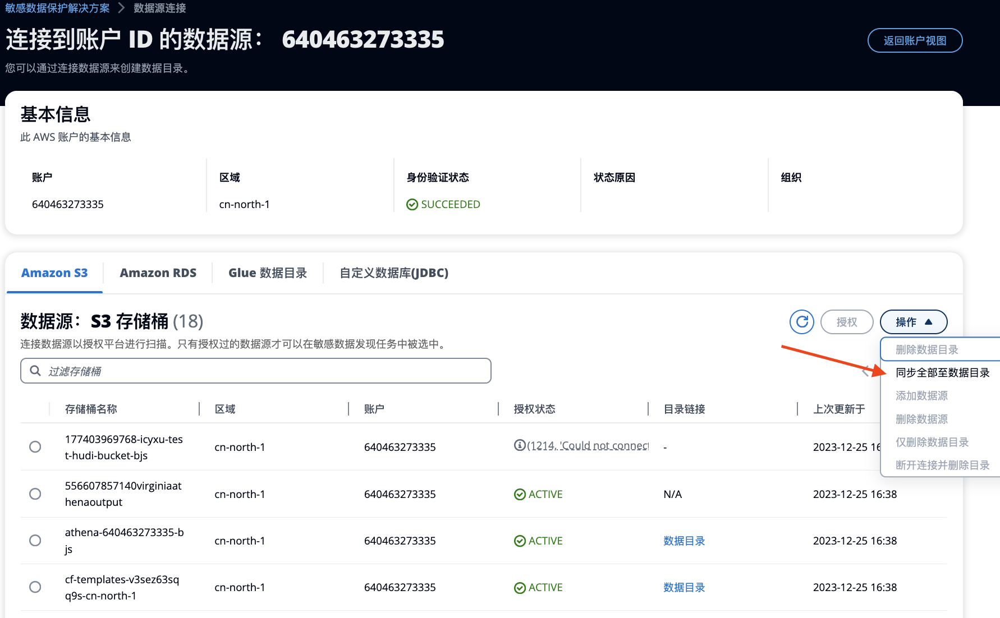

# 连接到数据源 - S3
添加云帐户后，您可以连接S3的数据源进行敏感数据扫描，连接也是一个授权的过程。

!!! Info "支持扫描的数据/文件类型"
    请参阅[附录：方案支持扫描的数据类型](appendix-built-in-supported-datatypes.md)。

### 前提条件
如果您需要扫描非结构化数据（如文档、代码、邮件、图片等）。请提升Service quota。

* **Global regions**：请通过[Service Quota服务](https://console.aws.amazon.com/servicequotas/home)自助提升待扫描区域的SageMaker Processing Job实例配额。
* **China regions**：请联系AWS销售开“配额提升工单”，内容参考：'您好，请把本账号某区域（例如，cn-northwest-1）区域对应SageMaker Processing Job ml.m5.2xlarge实例的并行运行数量提升到100'。

## 连接S3数据源
1. 从左侧菜单，选择**连接数据源** 
2. 选择**AWS Cloud**标签
3. 单击进入AWS帐户，打开详细页面。
4. 在 **Amazon S3** 标签页中，查看解决方案部署区域中的 S3 存储桶列表。
5. 选择一个S3存储桶，点击 **授权**。 或者，您也可以从 **操作** 列表中选择 **批量授权**，快速授权所有S3桶。
 
1. 大约半分钟后，您可以看到 **授权状态** 为绿色 `ACTIVE`。

至此，您已经连接好了S3数据源，可以开始下一步操作👉[定义分类分级模版](data-identifiers.md)了。