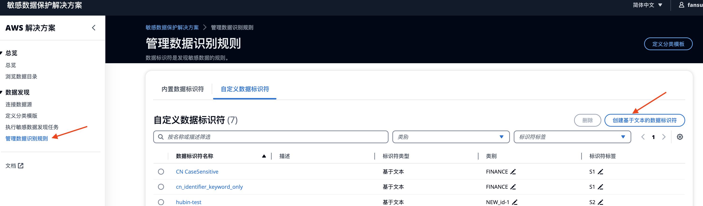
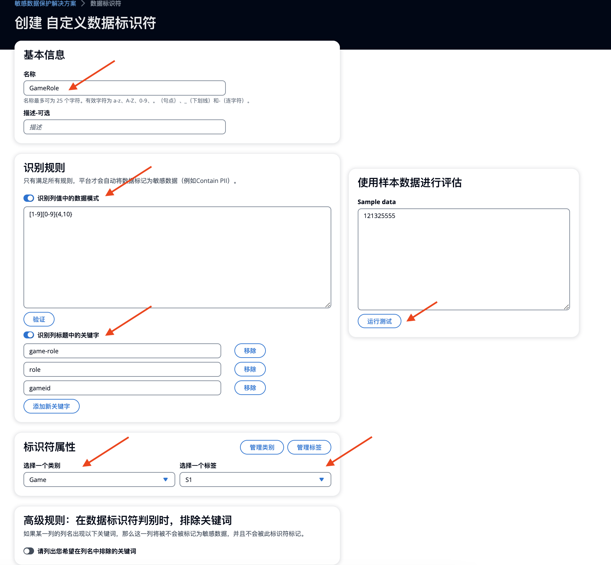
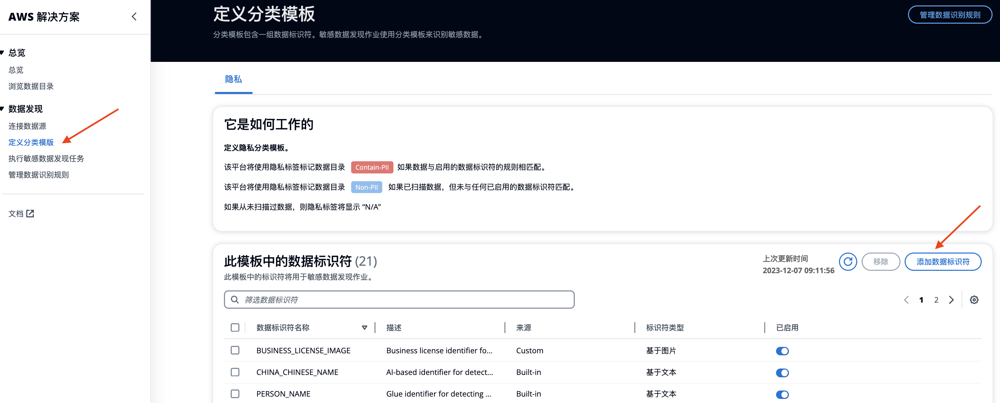

# 定义分类分级模版

## 概念
- 数据标识符是检测某一敏感数据的具体规则。如身份证标识符、邮箱标识符、姓名标识符等。
- 模板是一套数据标识符的集合。模板将用于敏感数据发现作业。

!!! Info "最佳实践"
    您需要了解在您的公司中，什么样的数据被定义为敏感数据，以及这些敏感数据的识别规则。只有那些可以通过正则表达式定义或者AI定义的敏感数据才可以通过技术手段（例如，利用SDP方案）进行识别。在定义了数据标识符后，您需要将它们添加至模版。敏感数据扫描任务在运行时会将数据源中的数据与模版中的规则进行一一匹配，并在数据目录中对其进行标记。

## 查看和编辑内置的数据标识符

方案提供内置的数据标识符，这些标识符主要是基于国家分类的隐私数据规则，为您决定如何进行数据分类提供参考。

在**管理数据识别规则**页面， **内置数据标识符** 标签页中，您可以看到内置的数据标识符的列表。有关完整列表，请参见[附录 - 内置数据标识符](appendix-built-in-identifiers.md)。

您可以单击  编辑图标，可以调整数据分级分类。默认情况下，这些数据标识符具有`PERSONAL`类别属性和`S2`/`S3`/`S4`标识符标签属性。您可以根据自己的敏感数据更新这些属性。

 

## 创建和编辑自定义数据标识符
在 **管理数据识别规则** 页面， **自定义数据标识符** 标签页中，您可以看到您定义的自定义数据标识符列表。默认情况下，该列表为空。您可以根据业务敏感数据定义创建或删除数据标识符。

您可以单击  编辑图标，可以调整数据分级分类。例如，您可以将类别定义为`FINANCE`/`AUTO`/`GENERAL`，并将数据敏感级别定义为`Level1`/`Level2`/`Level3`/`Level4`。

要创建新的数据标识符，请选择 **创建基于文本的数据标识符** 。

在数据标识符创建页面，您可以定义敏感数据扫描的规则，具体参数如下表。
 

| 参数          | 是否必填 | 参数描述                                                   |
|-------------|------|---------------------------------------------------------|
| **名称**     | 必填  | 数据标识符的名称，用于在扫描到敏感数据时进行自动标记。                  |
| **描述**     | 选填  | 对标识符的额外说明，有助于理解其用途和上下文。                        |
| **识别规则**  | 必填  | 定义用于识别数据的规则，可以是基于列名关键字、正则表达式，或二者的结合。 |
| **标识符属性** | 选填  | 允许对标识符进行分类和分级，例如按行业（如：Finance, Game, Personal 等）或安全级别（如：S1, S2, S3 等）。 |
| **高级规则：排除关键词** | 选填  | 定义不应被标记为敏感数据的列名关键词。                            |
| **高级规则：非结构化数据** | 选填  | 适用于特定安全级别（如S3），包括识别规则出现的频率和关键词与正则相距字符数的设置。 |

## 将数据标识符添加到模板

1. 在左侧菜单栏选择，**定义分类模板**。
2. 选择**添加数据标识符**。您将在窗口中看到侧边栏显示了所有数据标识符。
3. 选择一个或多个数据标识符并选择**添加到模板**。
 

## 从模板删除数据标识符
如需删除，选择模板中的数据标识符并选择 **删除**。

## 从模板启用/禁用数据标识符

如需临时启用/禁用，您可以调整模版中标识符右侧的开关，选择 **启用** 或禁用它。如果您禁用了一个数据标识符，则相关作业将不会根据该标识符检测数据。禁用标识符通常用于测试目的。

----------

## 示例：敏感数据发现任务后数据标识符在数据目录中的标记方式。

假设我们想要在名为 **"PizzaOrderTable"** 的表中检测敏感数据。

| id | user_name      | email_address        | order_id   |
|----|----------------|----------------------|------------|
| 1  | aaa_frankzhu   | frankzhu@mail.com    | 12344536   |
| 2  | aaa_zheng      | zhm@mail.com         | 12344536   |
| 3  | aaa_patrickpark| ppark@example.com    | 12344536   |
| 4  | aaa_kyle       | kyle@qq.com          | 1230000    |

例如，我们定义了5个自定义数据标识符：

| Identifier Name | Regex                                              | Keyword                                       |
|-----------------|----------------------------------------------------|-----------------------------------------------|
| OrderInfo1      | OrderInfo1                                         | order                                         |
| OrderInfo2      | (disabled)                                         | _id                                           |
| UserEmail       | `^[a-zA-Z0-9._%+-]+@[a-zA-Z0-9.-]+\.[a-zA-Z]{2,}$` | (disabled)                                    |
| EmailAddress    | (disabled)                                         | themail, email-address, email_address         |
| UserPrefix      | aaa_                                               | user                                          |
 
假设上述所有标识符都已添加到分类模板中，然后我们启动了一个发现任务。 "PizzaOrderTable" 数据目录的结果如下：

| Column         | Identifiers             | Privacy       |
|----------------|-------------------------|---------------|
| id             | N/A                     | Non-PII       |
| user_name      | UserPrefix              | Contain-PII   |
| email_address  | UserEmail, EmailAddress | Contain-PII   |
| order_id       | OrderInfo2              | Contain-PII   |

**标识符解释:**

- 标识符 "OrderInfo1" 未匹配，因为正则表达式与数据模式不匹配。
- 标识符 "OrderInfo2" 标记在 "order_id" 列上，因为关键字 "_id" 部分匹配列名 "order_id"。
- 标识符 "UserEmail" 标记在 "email_address" 列上，因为正则表达式匹配 "email_address" 列值的数据模式。
- 标识符 "EmailAddress" 标记在 "email_address" 列上，因为关键字 "email_address" 之一匹配列名。
- 标识符 "UserPrefix" 标记在 "user_name" 列上，因为正则表达式和关键字都匹配。

**隐私标签解释:**

- "user_name"、"email_address" 和 "order_id" 列被标记为(包含个人身份信息)隐私标签，因为已匹配到标识符。
- "id" 列被标记为(不包含个人身份信息)隐私标签，因为没有匹配到标识符。