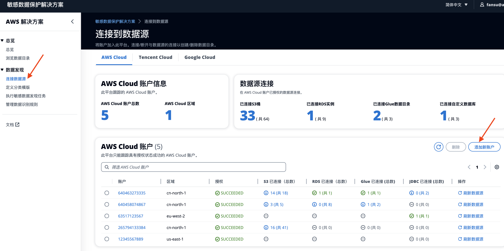

# 连接到数据源

## 添加AWS账号

1. 左侧菜单中，选择**连接数据源**。
2. 选择AWS Cloud页签。
3. 点击按钮 **添加新账户**。
  
4. 选择以下一种账号添加方式：

    #### 方式一： 通过CloudFormation授权 （适用于同AWS region，自动发现S3，RDS，AWS Glue）
    1. 打开**独立AWS账户**标签页
    2. 按照此页面 **步骤1** 和 **步骤2** 中的说明安装 Agent CloudFormation 堆栈（约3mins）,用于授权待检测账号。详细权限信息请参阅[附录：Agent CloudFormation 堆栈的权限](./appendix-permissions.md)
    3. 在页面填写待检测的AWS账户ID，选择需要数据源所在的区域。
    4. 点击按钮 **添加此账户**。

    #### 方式二：通过JDBC方式连接数据库 （适用于多AWS region，手动添加数据库，如Redshift，EC2自建数据库，多云数据库）
    5. 打开**JDBC Only**标签页。
    6. 选择regions
    7. 填写AWS账户ID
    8. 点击按钮 **添加此账户**

    #### 方式三：批量添加CloudFormation授权。（适用于同AWS region，自动发现S3，RDS，AWS Glue。通过AWS Organization批量管理账号）
    9. 打开**JDBC Only**标签页
    10. 按照此页面 **步骤1** , **步骤2** 和**步骤三**中的说明安装 Agent CloudFormation 堆栈。有关详细信息，请参阅[附录：通过组织添加 AWS 账户](appendix-organization.md)。
    11. 填写AWS Organizaion代理账户ID
    12. 点击按钮 **添加此账户**

## 添加其他云账号

1. 左侧菜单中，选择**连接数据源**。
2. 选择你需要添加的Cloud Provider的页签（如Tencent，Google）。
3. 点击按钮 **添加新账户**。
  
    #### 通过JDBC方式连接数据库 （适用于多云或者IDC，手动添加数据库）
    1. 填写账户ID
    2. 选择regions
    3. 点击按钮 **添加此账户**