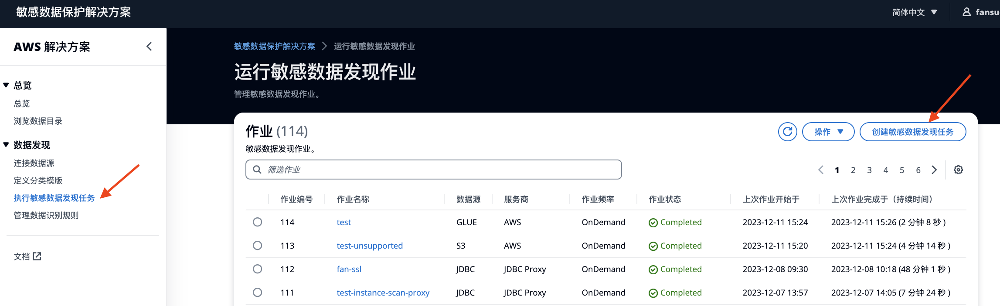

您可以创建和管理用于检测敏感数据的作业。发现作业由一个或多个 AWS Glue 作业组成，用于实际数据检测。有关更多信息，请参阅[查看作业详细信息](discovery-job-details.md)。

## 创建发现作业

在左侧菜单，选择**执行敏感数据发现作业**

点击按钮，**创建敏感数据发现作业**。

**步骤1**: 选择Provider和数据源

| Provider | Data source |
|----------------|--------------------|
| AWS            | S3, RDS, Glue, Custom databases，Proxy databases |
| Tencent        | JDBC               |
| Google         | JDBC               |

!!! Info "AWS的CustomDB和ProxyDB是指什么？"
    - 如果是本账号扫描，连接JDBC数据源，那么，请选择CustomDB
    - 如果您添加账号时，选择了CloudFormation的安装方式，连接了JDBC数据源，那么，请选择Custom databases
    - 如果您添加账号时，选择了JDBC Only的安装方式，连接了JDBC数据源，那么，请选择Proxy databases

**步骤2**: 选择具体待扫描的数据源

**步骤3**: 作业设置

| 作业设置 | 描述 | 选项 |
| --- | --- | --- |
| 扫描频率 | 指发现作业的扫描频率。 | 按需运行  每日  每周  每月 |
| 扫描深度 | 指抽样行数。 | 100（推荐）  10, 30, 60, 100, 300, 500, 1000 |
| 扫描深度 - 非结构化数据 | 仅适用于S3，不同文件夹下，抽样非结构化文件数量 | 可跳过, 10文件, 30文件, 所有文件 |
| 扫描范围 | 定义目标数据源的整体扫描范围。 “全面扫描”表示扫描所有目标数据源。 “增量扫描”表示跳过自上次数据目录更新以来未更改的数据源。 | 全面扫描  增量扫描（推荐） |
| 检测阈值 | 定义作业所需的容忍度水平。如果扫描深度为 1000 行，则 10% 的阈值意味着如果超过 100 行（共 1000 行）匹配标识符规则，则该列将被标记为敏感。较低的阈值表示该作业对敏感数据的容忍度较低。 | 10%（推荐）  20%  30%  40%  50%  100% |
| 覆盖手动更新的隐私标签 | 选择是否允许该作业使用作业结果覆盖数据目录隐私标签。 | 不覆盖（推荐）  覆盖 |

**步骤4**：高级配置项

**步骤5**：作业预览
    预览作业后，选择**运行作业**。

---

### 关于增量扫描：
当在job选择“增量扫描”设置的时候，S3和RDS的扫描逻辑略有不同，如下：

S3: 当S3对象有任何变化的情况下，增量扫描会对该路径Folder层面进行扫描

- 举例：1个桶，3个folder里面各含有一种csv文件（不同schema），当其中一个folder的文件schema有所更改。那么，在增量扫描的时候，Job只会对这个folder下面的csv文件进行扫描，不会扫描另外2个folder。

- 举例：1个桶，3个folder里面各含有一种csv文件（不同schema），当其中一个folder的文件schema不变，但是增加了行数或者文件有任何更新。在增量扫描的时候，Job只会对这个folder下面的csv文件进行扫描，不会扫描另外2个folder。

RDS: 只有当RDS表有列级别变化的时候，增量扫描会对该表进行扫描

- 举例：1个RDS instance，3个table，当其中一个table的表结构schema变化（新增或删除列）。那么，在增量扫描的时候，只会对这个table进行扫描，跳过另外2个table。
- 举例：1个RDS instance，3个table，当其中一个table的表结构schema不变，但新增/删除了行，那么，在增量扫描的时候，这3个table都不会被扫描。
