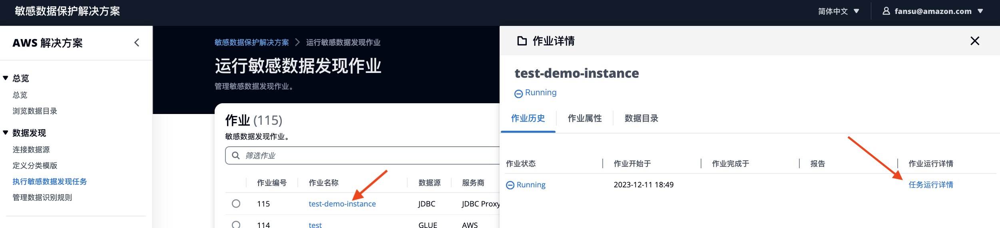
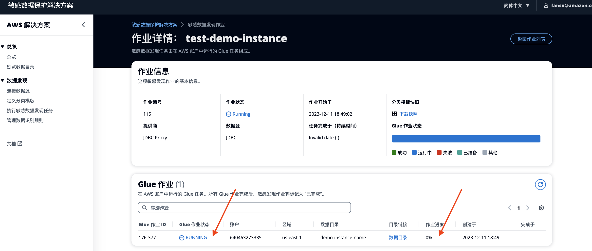

敏感数据发现作业由在监控的 AWS 账户（与数据源相同的账户）中运行的 Glue 作业组成。

* 回到敏感数据任务的列表中，可以看到作业状态 为 `Running`。
* 查看任务进度：点击这个任务，在侧边栏，点击 **任务运行详情**。
 

* 进度在开始的一段时间为0%，不要着急，此时后台在检测数据结构是否有变化。等实际数据扫描开始，进度才变化。
     
!!! Info "运行时长"
    时间长短取决于抽样率、待检测表、模版中标识符的数量。 
    举例：1个实例400张表，扫描深度为30，模版中21个规则，大约需要25分钟。
    不同的S3桶/数据库实例，后台会并行扫描。

* 等待Glue作业状态变为`SUCCEEDED`。表示扫描任务完成。
* 如果 Glue 作业失败，您可以单击 `FAILED` 状态查看其错误日志。

## 下载分类模板快照
您可以下载作业开始运行时的模板快照。快照显示了该作业正在使用哪些数据标识符。

在 **作业详细信息** 页面上，选择 **下载快照** 以 JSON 格式（.json）下载模板快照。
